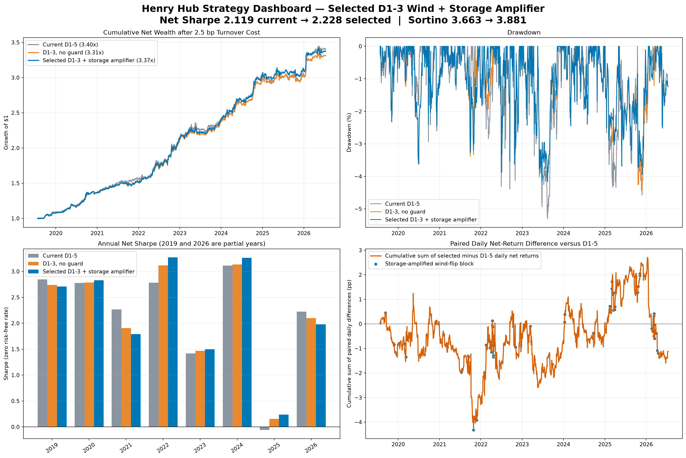
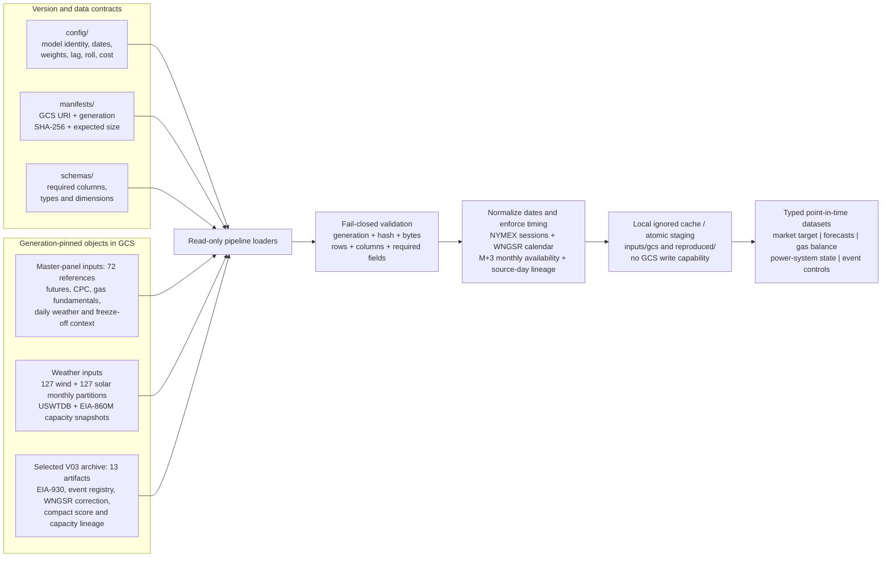
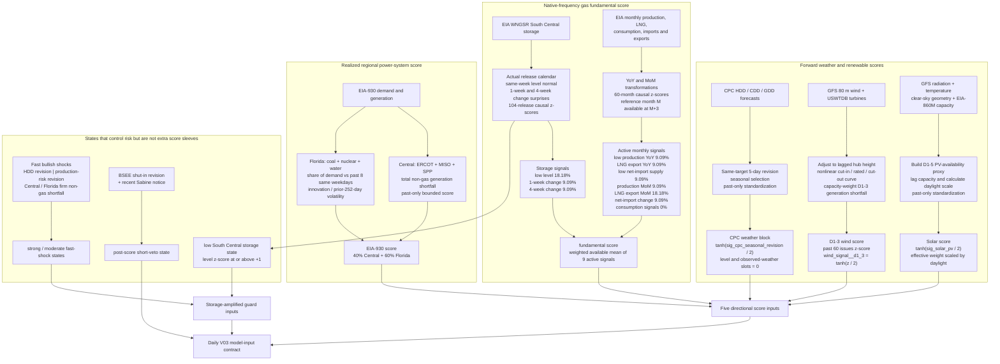
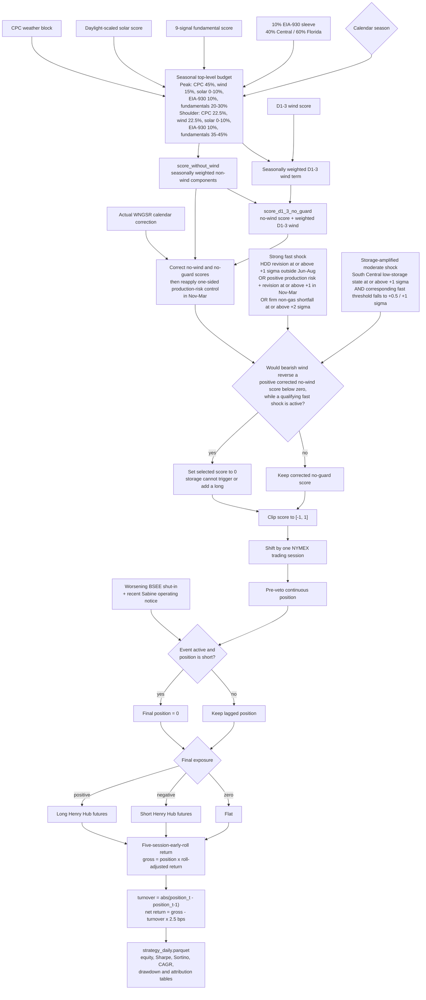

# Henry Hub weather and fundamental strategy

This folder is a reproducible model-development handoff for my 2026 research
on a directional NYMEX Henry Hub natural-gas futures model. It contains the
model implementation, factor and panel builders, hypothesis tests, notebooks,
an audit-oriented report, and small result artifacts. Large inputs remain in
Google Cloud Storage; dated manifests pin their object generations, SHA-256
checksums, dimensions, and schemas.

## Model sequence

Model names use a permanent chronological prefix. Lifecycle state is stored
separately, so a future promotion does not require another file rename. The
machine-readable source of truth is
[`config/model_registry.yaml`](config/model_registry.yaml).

| Order | Stable model id | Lifecycle state | Role |
|---:|---|---|---|
| V01 | `hh_v01_south_central_storage` | Frozen formal baseline | Historical 2017--2026 provenance and formal reproduction baseline |
| V02 | `hh_v02_eia930_central_florida` | Superseded research | Added the Central 40% / Florida 60% EIA-930 sleeve |
| V03 | `hh_v03_d1_3_storage_guard` | **Current selected research** | Retains V02 and adds the D1--3 wind horizon plus storage-amplified guard |

Wind, solar, native-frequency, and weight-selection work under
`results/experiments/` are factor experiments, not additional model versions.

## V01 — historical formal baseline

The frozen V01 formal baseline combines CPC forecast revisions, capacity-weighted
nonlinear wind and solar availability, South Central natural-gas storage, and
lagged U.S. gas fundamentals. The backtest uses one-session signal lag, a
five-trading-day early front-month roll, and 2.5 bps of cost per unit of
turnover.

| Metric | Current fixed version |
|---|---:|
| Sample | 2017-07-03 to 2026-07-13 |
| Trading days | 2,264 |
| Net Sharpe (zero RF) | **1.667** |
| Net CAGR | **14.59%** |
| Annualized volatility | 8.20% |
| Maximum drawdown | -6.14% |
| Daily win rate | 52.61% |
| Total net return | 241.80% |

These are historical research results, not an estimate of live performance.
The EIA histories used here may contain revisions, and some source datasets do
not have archived first-release vintages.


The year-by-year table and chart are available in
[`results/models/v01_south_central_storage/`](results/models/v01_south_central_storage/).

### V03 — current selected research model

The latest selected research version retains the 40% Central / 60% Florida
EIA-930 sleeve and changes the wind forecast window from days 1--5 to days
1--3. A one-sided direction guard prevents bearish wind from reversing an
otherwise bullish score only when a strong fast bullish shock is present, or
when low South Central inventory coincides with a moderate fast bullish shock.
Low inventory cannot trigger the guard by itself, and the guard cannot create
or amplify exposure.

<!-- BEGIN AUTO-GENERATED: d1-full-table -->
| Common-overlap metric | Current D1--5 | D1--3, no guard | Selected D1--3 + storage amplifier |
|---|---:|---:|---:|
| Sample | 2019-07-25 to 2026-07-13 | same | same |
| Trading days | 1,748 | 1,748 | 1,748 |
| Net Sharpe | 2.119 | 2.181 | **2.228** |
| Net Sortino | 3.663 | 3.787 | **3.881** |
| Net CAGR | **19.20%** | 18.74% | 19.05% |
| Maximum drawdown | -5.30% | -4.51% | **-4.16%** |
| Total net return | **240.11%** | 231.09% | 237.22% |
<!-- END AUTO-GENERATED: d1-full-table -->

This is an explicit risk-adjusted selection: Sharpe, Sortino, and drawdown
improve, while CAGR and cumulative return remain below the D1--5 comparator.
<!-- BEGIN AUTO-GENERATED: d1-drawdown-claim -->
Relative to unguarded D1--3, the guard improves maximum drawdown from -4.51%
to -4.16%, a 0.34 percentage-point reduction in drawdown depth.
<!-- END AUTO-GENERATED: d1-drawdown-claim -->
The HDD guard is disabled in June--August and active in every other month;
there is no CDD branch. It changes 59 held-return dates and adds 1.81
percentage points to the simple sum of paired daily net-return differences
versus unguarded D1--3 after costs; the corresponding compounded final-wealth
difference is +6.12 percentage points. Versus D1--5, those two distinct
quantities are -1.11 and -2.89 percentage points, respectively.

These figures include the NYMEX holiday-session correction, the audited EIA
WNGSR holiday release calendar, and a continuous Florida signal built from all
complete BAs on each source day. Partial-BA observations remain in the future
rolling reference, so the five previously omitted returns are now retained.



### Selected-strategy metric conventions

<!-- BEGIN AUTO-GENERATED: metric-conventions -->
The selected D1--3 and EIA-930 tables report zero-risk-free-rate Sharpe and
Sortino ratios from daily log net returns, `g_t = log(1 + r_t)`. Sharpe is
`mean(g_t) / sample_std(g_t) * sqrt(252)`. Sortino is `mean(g_t) * 252`
divided by the zero-target unconditional lower-partial-moment denominator
`sqrt(mean(min(g_t, 0)^2)) * sqrt(252)`; positive-return days therefore enter
the downside average as zeros. This is not the conditional-negative-day
Sortino convention. For the selected strategy, arithmetic-return Sharpe is
2.261 versus the reported 2.228, and conditional-negative-day log Sortino is
2.648 versus the reported 3.881. CAGR uses the actual first settlement
endpoint, maximum drawdown begins from initial wealth 1.0, and all reported
ratios use 252 sessions per year.
<!-- END AUTO-GENERATED: metric-conventions -->

### V02 — superseded EIA-930 research model

The prior selected EIA-930 version preserves the nine-factor fundamental
block and adds two post-score controls: a fixed 10% EIA-930 sleeve and a
one-sided BSEE/Sabine event veto.  The EIA sleeve is 40% Central
(ERCOT/MISO/SPP total non-gas shortfall) and 60% Florida (coal, nuclear, and
water shortfall relative to demand).  It is funded from fundamentals, so it
does not add leverage or change the gross seasonal budget.  The event
controller can cancel a conflicting short but cannot create or amplify a
position.

The EIA-930 comparison begins when the checked-in generation panel becomes
available. All rows in both columns use the same dates, futures returns, roll,
one-session signal lag, and 2.5 bps turnover cost.

<!-- BEGIN AUTO-GENERATED: eia-full-table -->
| Common-overlap metric | Weather, fundamentals, and event veto | Previous 10% Central sleeve | Selected Central 40% / Florida 60% |
|---|---:|---:|---:|
| Sample | 2019-07-25 to 2026-07-13 | same | same |
| Trading days | 1,748 | 1,748 | 1,748 |
| Net Sharpe | 1.856 | 1.951 | **2.084** |
| Net Sortino | 3.157 | 3.252 | **3.576** |
| Net CAGR | 17.99% | 19.07% | **19.24%** |
| Maximum drawdown | -6.14% | -6.07% | **-5.29%** |
| Total net return | 216.61% | 237.47% | **240.73%** |
<!-- END AUTO-GENERATED: eia-full-table -->

<!-- BEGIN AUTO-GENERATED: eia-readme-claim -->
Relative to the Central sleeve, the selected blend improves Sharpe by 0.132,
Sortino by 0.324, and maximum drawdown by 0.79 percentage points. Its simple
sum of daily incremental net returns is +0.66 percentage points; the distinct
compounded final-wealth difference is +3.26 percentage points. The benefit is
downside diversification rather than a large unconditional daily-return
increment. It is an incremental research enhancement, not a rewrite of the
approved 2017 full-history baseline.
<!-- END AUTO-GENERATED: eia-readme-claim -->


## Where to start

1. [`MODEL_CARD.md`](MODEL_CARD.md) — signal definitions, weights, timing,
   execution assumptions, splits, and limitations.
2. [`notebooks/01_model_v01_south_central_storage.ipynb`](notebooks/01_model_v01_south_central_storage.ipynb)
   — frozen formal baseline and earlier selected-enhancement context.
3. [`notebooks/07_model_v03_d1_3_storage_guard.ipynb`](notebooks/07_model_v03_d1_3_storage_guard.ipynb)
   — current selected D1--3 wind window, storage-amplified guard, performance,
   intervention audit, and dashboard.
4. [`notebooks/06_model_v02_eia930_central_florida.ipynb`](notebooks/06_model_v02_eia930_central_florida.ipynb)
   — prior selected 40/60 EIA-930 sleeve and geographic weight audit.
5. [`RESEARCH_LOG.md`](RESEARCH_LOG.md) — what was tested, accepted, rejected,
   and deliberately excluded from the formal model.
6. [`reports/comprehensive_strategy_report.md`](reports/comprehensive_strategy_report.md)
   — detailed English-language strategy and causality report.
7. [`reports/model_v03_d1_3_storage_guard_brief.md`](reports/model_v03_d1_3_storage_guard_brief.md)
   — concise decision record for the current selected version.
8. [`reports/model_v02_eia930_central_florida_brief.md`](reports/model_v02_eia930_central_florida_brief.md)
   — concise selected-version decision record.
9. [`DATA_MANIFEST.md`](DATA_MANIFEST.md) — exact GCS objects and local paths.

## Repository layout

```text
henry-hub-natural-gas/
├── README.md
├── MODEL_CARD.md
├── DATA_MANIFEST.md
├── RESEARCH_LOG.md
├── requirements.txt
├── requirements-build.lock     # exact verified Python package versions
├── .python-version             # Python 3.13.5
├── config/                     # model registry and frozen policy
├── manifests/                  # immutable input generations and checksums
├── schemas/                    # exact Arrow input schemas
├── inputs/audit/               # documentation for remote audit inputs
├── notebooks/
│   ├── 01_model_v01_south_central_storage.ipynb
│   ├── 02_capacity_weighted_wind.ipynb
│   ├── 03_capacity_weighted_solar.ipynb
│   ├── 04_native_frequency_fundamentals.ipynb
│   ├── 05_fundamental_weight_selection.ipynb
│   ├── 06_model_v02_eia930_central_florida.ipynb
│   └── 07_model_v03_d1_3_storage_guard.ipynb
├── naturalgas/                 # versioned evaluators and dependency modules
├── reports/                    # detailed Markdown and XeLaTeX report
├── results/models/             # V01/V02/V03 canonical model results
├── results/experiments/        # factor experiments and diagnostics
└── tests/
```

## Strategy data and trading flow

The three diagrams below follow the strategy itself: read immutable data,
transform each information group into causal scores, then combine those scores
into a lagged Henry Hub futures position.

### 1. Read and validate the data

The supported rebuild starts from exact internal GCS objects, not from fresh
queries to mutable public APIs. Manifests identify each object generation and
the loaders are read-only.



The two raw capacity snapshots also appear in the 13-artifact selected
archive. The numbers above describe manifest roles and therefore are not
counts of mutually exclusive GCS objects.

### 2. Transform data into the scores used by V03

Every directional score is oriented so that a positive value is bullish
natural gas. Rolling reference distributions exclude the current observation.



Fast weekly and YoY fundamental z-scores are bounded with `tanh(z / 2)` before
aggregation; the four slow monthly MoM signals enter as oriented causal
z-scores. The EIA-930 and event histories are validated frozen processed
contracts in the current reproducibility boundary; the D1--3 wind signal is
also rebuilt independently from pinned GFS and USWTDB inputs and required to
match the compact contract exactly.

### 3. Combine scores, choose the position, and calculate the trade return

The selected model uses continuous exposure rather than a discrete buy/sell
classifier. A score of `+0.30` targets a 30% long; `-0.30` targets a 30% short.



This is the backtest execution convention, not an order-level fill simulator:
it does not separately simulate bid--ask spread, market impact, two-leg roll
slippage, margin, liquidity, or failed fills. Files under `reproduced/` are
local audit outputs; files under `results/models/` are the checked-in canonical
research record.

## Reproduce the approved model

The verified environment is Python 3.13.5 with the exact package versions in
`requirements-build.lock`:

```bash
python -m venv .venv
source .venv/bin/activate
python -m pip install -r requirements-build.lock
```

`requirements.txt` contains wider compatibility ranges for development, but it
is not the approved byte-reproduction environment.

With Braeswood GCS read credentials available, run the supported full build:

```bash
python -m naturalgas.pipelines.rebuild_all --overwrite
```

This validates 72 master-panel input objects, 254 NCAR/GDEX weather
partitions, two raw capacity snapshots, and all 13 objects in the selected
strategy archive. It then rebuilds the
155-column master panel, the selected wind/solar artifacts, the causal
D1/D1--3/D1--5 wind-horizon lineage, the formal strategy, and the selected
D1--3 strategy. The panel and all four weather-factor parquets are checked
against their approved SHA-256 values. The formal and selected strategies are
then checked against their shipped metrics before the verified output
directory is published. The command only reads GCS and writes local outputs.

For a quicker formal panel-to-strategy audit that downloads the
already-approved weather factors and skips the selected D1--3 raw-lineage
step, use:

```bash
python -m naturalgas.pipelines.rebuild_all \
  --use-approved-weather-artifacts --overwrite
```

The narrowest processed-input reproduction remains available as:

```bash
python -m naturalgas.pipelines.rebuild_model_v01 --overwrite
```

This downloads the seven exact GCS object generations in the manifest,
validates their byte hashes, sizes, row/column counts, and Arrow schemas, then
runs the evaluator using only those local snapshots. It writes results and a
verification receipt under:

```text
reproduced/models/v01_south_central_storage/
```

The pipeline checks the V01 model identity, trading-day count, Sharpe, CAGR,
maximum drawdown, win rate, and every summary field except the legacy Lower 48
comparison delta. That comparison-only field can differ because the narrow
manifest retains the pre-holiday-correction panel; both values and the full
summary hashes are written to the receipt. The primary `rebuild_all` path
rebuilds the corrected panel and requires the complete V01 summary to match
`results/models/v01_south_central_storage/summary.json`. After the seven inputs have
been downloaded once, add `--offline` to rerun without contacting GCS.

To verify the shipped result after reproduction:

```bash
pytest -q
```

The selected EIA-930 enhancement keeps the formal daily result in Git and
materializes its compact audit inputs from exact GCS generations:

```bash
python naturalgas/evaluate_model_v02_eia930_central_florida.py
```

This command refreshes the selected daily series, annual metrics, event
registry, summary, and English dashboard under
`results/models/v02_eia930_central_florida/`.

The quickest downstream reproduction of the current selected D1--3 strategy
materializes the compact score, WNGSR correction, and event inputs from their
generation-pinned GCS manifest into the ignored `inputs/gcs` cache:

```bash
python naturalgas/evaluate_model_v03_d1_3_storage_guard.py
```

The evaluators fetch missing default audit inputs automatically. To populate
and validate the complete audit cache explicitly, run:

```bash
python -m naturalgas.audit_inputs
```

This refreshes the selected daily series, full/period/annual metrics, event
registry, summary, and English dashboard under
`results/models/v03_d1_3_storage_guard/`.

When either selected evaluator successfully writes to its canonical results
directory, it automatically synchronizes the generated metric tables and
claims in the primary documents. Custom `--output-dir` runs—including
`/tmp`, staging, and `reproduced/` rebuilds—never modify documentation.
The synchronization can also be invoked or checked directly:

```bash
python -m naturalgas.sync_documentation_metrics
python -m naturalgas.sync_documentation_metrics --check
```

The first command renders from the D1--3 `strategy_metrics.csv`, the EIA-930
`summary.json`, and the selected daily artifact; `--check` is the read-only CI
guard used to detect documentation drift. GitHub Actions runs this guard and
the source-driven documentation tests on every relevant push and pull request.

To audit the selected D1--3 chain from immutable GCS inputs, use:

```bash
python -m naturalgas.pipelines.rebuild_model_v03 --overwrite
```

This command reads the exact 127 NCAR/GDEX GFS object generations and raw
USWTDB snapshot pinned in `manifests/weather_factor_inputs_2026-07-28.json`,
selects same-day 00Z issues and D1--3 leads, rebuilds the annual capacity
weights, constructs the past-only 60-initialization z-score, and requires exact
daily equality with both wind columns consumed by the selected strategy. It
also downloads and validates every exact EIA-930/event/storage/score object in
`manifests/selected_strategy_inputs_2026-08-14.json`, then runs the evaluator
and writes a reproduction receipt under
`reproduced/models/v03_d1_3_storage_guard/`.
Use `rebuild_all` above when the formal baseline must also be rebuilt from its
generation-pinned GCS inputs in the same run.

Networked integration tests are opt-in because ordinary CI may not have access
to the private bucket:

```bash
RUN_HENRY_HUB_MODEL_V01_CHAIN=1 pytest -q tests/test_rebuild_model_v01.py
RUN_GCS_PANEL_PARITY=1 pytest -q tests/test_build_multisignal_panel.py
RUN_HENRY_HUB_WEATHER_CHAIN=1 pytest -q tests/test_rebuild_weather_factors.py
RUN_HENRY_HUB_MODEL_V03_CHAIN=1 pytest -q tests/test_rebuild_model_v03.py
RUN_HENRY_HUB_FULL_CHAIN=1 pytest -q tests/test_rebuild_all.py
```

### Notebook clean-run requirements

| Notebook | Clean-run inputs and behavior |
|---|---|
| `01_model_v01_south_central_storage.ipynb` | Preserves V01, the frozen historical full-sample baseline, and the earlier Central-only EIA-930 research snapshot. Use notebook 07 for current V03. |
| `02_capacity_weighted_wind.ipynb` | Needs the manifest panel and 00Z wind parquet; its two audit CSVs are materialized from generation-pinned GCS objects. The nonlinear power-curve helper is source code in `naturalgas/`. |
| `03_capacity_weighted_solar.ipynb` | Reads its summary, IC, annual, and cost tables from tracked `results/experiments/solar/`. Weight-grid and daily-equity cells are optional and report a clear skip unless generated with `python naturalgas/evaluate_ncar_gdex_complete_solar_factor.py`. |
| `04_native_frequency_fundamentals.ipynb` | Recomputes immediately and needs the four model parquets plus access to the three EIA inputs. It is a research notebook, not the strict final-rebuild entry point. |
| `05_fundamental_weight_selection.ipynb` | Has `RUN_BACKTEST=True` and later perfect-information cells that access EIA data. It requires all model inputs and Braeswood GCS read credentials and is not part of the strict formal reproduction guarantee. |
| `06_model_v02_eia930_central_florida.ipynb` | Rebuilds superseded research model V02 from the checked-in V01 daily result and generation-pinned GCS Central/Florida overlay and event registry. The first clean run requires private-bucket read access. |
| `07_model_v03_d1_3_storage_guard.ipynb` | Rebuilds current selected research model V03 from the checked-in V01 daily result and generation-pinned GCS score, WNGSR-correction, and event inputs. The first clean run requires private-bucket read access. |

The notebooks retain historical rendered outputs. A dependency audit must
execute them from a fresh kernel; the presence of saved output is not evidence
that the current checkout has all required inputs.

## Wind provenance

The selected capacity-weighted wind parquet contains **00Z initializations
only** (`forecast_cycle_hour_utc == 0`); it is not a four-cycle output. Its
direct weather source is the NCAR GDEX raw point archive under
`raw/weather/ncar_gdex/d084001/wind_points/`. The upstream archive includes
00Z, 06Z, 12Z, and 18Z forecasts, but the formal wind signal selects 00Z before
the daily artifact is written. The separate `processed/.../wind_daily/`
partitions belong to an intermediate/equal-location path and are not the
direct input to the selected capacity-weighted artifact.

The complete weather-factor inventory is
[`manifests/weather_factor_inputs_2026-07-28.json`](manifests/weather_factor_inputs_2026-07-28.json).
It enumerates all 127 wind and 127 solar partitions plus generation-pinned raw
USWTDB and EIA-860M snapshots. The raw capacity snapshots rebuild the checked-in
wind/solar weight tables exactly. The manifest pins the byte-exact
D1/D1--3/D1--5 output as well as the formal wind/solar outputs. The factor-only
commands are also available for separate audits:

```bash
python -m naturalgas.pipelines.rebuild_weather_factors wind \
  --input-manifest manifests/weather_factor_inputs_2026-07-28.json \
  --output-dir reproduced/weather
python -m naturalgas.pipelines.rebuild_weather_factors wind-horizons \
  --input-manifest manifests/weather_factor_inputs_2026-07-28.json \
  --output-dir reproduced/weather
python -m naturalgas.pipelines.rebuild_weather_factors solar \
  --input-manifest manifests/weather_factor_inputs_2026-07-28.json \
  --output-dir reproduced/weather
```

## Reproducibility boundary

The supported guarantee starts from immutable internal base objects. It
rebuilds raw archived weather partitions into the selected wind/solar factors,
72 fixed direct inputs into the master panel, and those outputs into the formal
result through 2026-07-13.

It does not claim that re-querying current public APIs will reproduce history.
The upstream `daily_features`, CPC, futures, freeze-off, and EIA base tables are
frozen direct inputs because their public sources can revise and complete
first-release archives are unavailable. Re-downloading NCAR jobs, USWTDB, EIA,
Open-Meteo, FRED, or GPR today is therefore a data refresh, not a bit-exact
reproduction of the approved model.

## Model-version boundary

The approved historical result remains the fixed 1.667-Sharpe formal baseline.
The current selected research version is versioned separately because its
common history begins in 2019. It includes the fixed Central 40% / Florida 60%
EIA-930 sleeve, the one-sided BSEE/Sabine event veto, D1--3 wind, and the
storage-amplified fast-shock direction guard described above. It
does **not** include generic EBB pipeline alpha, geopolitical or
macro price overlays, weekend/holiday reopen trades, CPC forecast level,
observed-weather direct positioning, or the perfect-information experiment
that removes EIA production/consumption publication lags. Those items are
documented as exploratory or rejected tests, not silently mixed into the
reported results.
