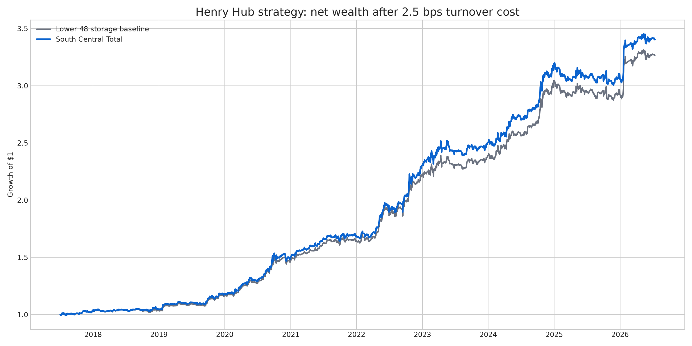
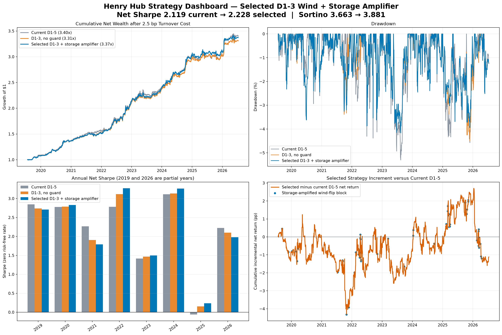
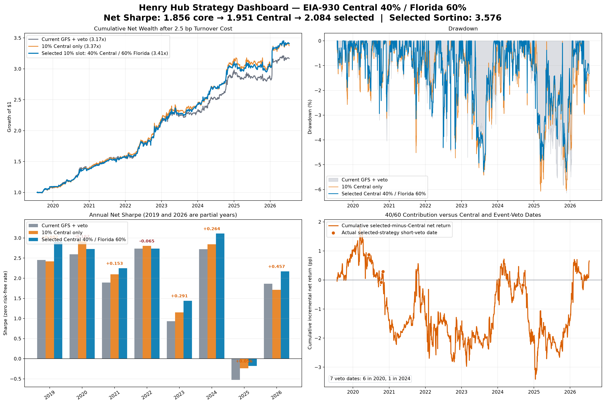

# Henry Hub weather and fundamental strategy

This folder is a reproducible model-development handoff for my 2026 research
on a directional NYMEX Henry Hub natural-gas futures model. It contains the
model implementation, factor and panel builders, hypothesis tests, notebooks,
an audit-oriented report, and small result artifacts. Large inputs remain in
Google Cloud Storage; dated manifests pin their object generations, SHA-256
checksums, dimensions, and schemas.

## Executive result

The current fixed version combines CPC forecast revisions, capacity-weighted
nonlinear wind and solar availability, South Central natural-gas storage, and
lagged U.S. gas fundamentals. The backtest uses one-session signal lag, a
five-trading-day early front-month roll, and 2.5 bps of cost per unit of
turnover.

| Metric | Current fixed version |
|---|---:|
| Sample | 2017-07-03 to 2026-07-13 |
| Trading days | 2,264 |
| Net Sharpe (zero RF) | **1.667** |
| Net CAGR | **14.59%** |
| Annualized volatility | 8.20% |
| Maximum drawdown | -6.14% |
| Daily win rate | 52.61% |
| Total net return | 241.80% |

These are historical research results, not an estimate of live performance.
The EIA histories used here may contain revisions, and some source datasets do
not have archived first-release vintages.



The year-by-year table and chart are available in
[`results/formal/`](results/formal/).

### Selected D1--3 wind and storage-amplified guard

The latest selected research version retains the 40% Central / 60% Florida
EIA-930 sleeve and changes the wind forecast window from days 1--5 to days
1--3. A one-sided direction guard prevents bearish wind from reversing an
otherwise bullish score only when a strong fast bullish shock is present, or
when low South Central inventory coincides with a moderate fast bullish shock.
Low inventory cannot trigger the guard by itself, and the guard cannot create
or amplify exposure.

| Common-overlap metric | Current D1--5 | D1--3, no guard | Selected D1--3 + storage amplifier |
|---|---:|---:|---:|
| Sample | 2019-07-25 to 2026-07-13 | same | same |
| Trading days | 1,748 | 1,748 | 1,748 |
| Net Sharpe | 2.119 | 2.181 | **2.228** |
| Net Sortino | 3.663 | 3.787 | **3.881** |
| Net CAGR | **19.20%** | 18.75% | 19.06% |
| Maximum drawdown | -5.30% | **-4.16%** | **-4.16%** |
| Total net return | **240.11%** | 231.09% | 237.22% |

This is an explicit risk-adjusted selection: Sharpe, Sortino, and drawdown
improve, while CAGR and cumulative return remain below the D1--5 comparator.
The HDD guard is disabled in June--August and active in every other month;
there is no CDD branch. It changes 59 held-return dates and adds 1.81
percentage points versus unguarded D1--3 after costs.

These figures include the NYMEX holiday-session correction, the audited EIA
WNGSR holiday release calendar, and a continuous Florida signal built from all
complete BAs on each source day. Partial-BA observations remain in the future
rolling reference, so the five previously omitted returns are now retained.



### Prior EIA-930 enhancement

The prior selected EIA-930 version preserves the nine-factor fundamental
block and adds two post-score controls: a fixed 10% EIA-930 sleeve and a
one-sided BSEE/Sabine event veto.  The EIA sleeve is 40% Central
(ERCOT/MISO/SPP total non-gas shortfall) and 60% Florida (coal, nuclear, and
water shortfall relative to demand).  It is funded from fundamentals, so it
does not add leverage or change the gross seasonal budget.  The event
controller can cancel a conflicting short but cannot create or amplify a
position.

The EIA-930 comparison begins when the checked-in generation panel becomes
available. All rows in both columns use the same dates, futures returns, roll,
one-session signal lag, and 2.5 bps turnover cost.

| Common-overlap metric | Weather, fundamentals, and event veto | Previous 10% Central sleeve | Selected Central 40% / Florida 60% |
|---|---:|---:|---:|
| Sample | 2019-07-25 to 2026-07-13 | same | same |
| Trading days | 1,748 | 1,748 | 1,748 |
| Net Sharpe | 1.856 | 1.951 | **2.084** |
| Net Sortino | 3.157 | 3.252 | **3.576** |
| Net CAGR | 17.99% | 19.07% | **19.24%** |
| Maximum drawdown | -6.14% | -6.07% | **-5.29%** |
| Total net return | 216.61% | 237.47% | **240.73%** |

Relative to the Central sleeve, the selected blend improves Sharpe by 0.132,
Sortino by 0.324, and maximum drawdown by 0.79 percentage points. Its simple
sum of daily incremental net returns is +0.66 percentage points, so the
benefit is downside diversification rather than unconditional return
expansion.  It is an incremental research enhancement, not a rewrite of the
approved 2017 full-history baseline.



## Where to start

1. [`MODEL_CARD.md`](MODEL_CARD.md) — signal definitions, weights, timing,
   execution assumptions, splits, and limitations.
2. [`notebooks/01_final_south_central_strategy.ipynb`](notebooks/01_final_south_central_strategy.ipynb)
   — approved historical baseline and earlier selected-enhancement context.
3. [`notebooks/07_d1_3_storage_amplified_strategy.ipynb`](notebooks/07_d1_3_storage_amplified_strategy.ipynb)
   — current selected D1--3 wind window, storage-amplified guard, performance,
   intervention audit, and dashboard.
4. [`notebooks/06_eia930_central_florida_40_60.ipynb`](notebooks/06_eia930_central_florida_40_60.ipynb)
   — prior selected 40/60 EIA-930 sleeve and geographic weight audit.
5. [`RESEARCH_LOG.md`](RESEARCH_LOG.md) — what was tested, accepted, rejected,
   and deliberately excluded from the formal model.
6. [`reports/comprehensive_strategy_report.md`](reports/comprehensive_strategy_report.md)
   — detailed English-language strategy and causality report.
7. [`reports/d1_3_storage_amplified_strategy_brief.md`](reports/d1_3_storage_amplified_strategy_brief.md)
   — concise decision record for the current selected version.
8. [`reports/eia930_central_florida_40_60_brief.md`](reports/eia930_central_florida_40_60_brief.md)
   — concise selected-version decision record.
9. [`DATA_MANIFEST.md`](DATA_MANIFEST.md) — exact GCS objects and local paths.

## Repository layout

```text
henry-hub-natural-gas/
├── README.md
├── MODEL_CARD.md
├── DATA_MANIFEST.md
├── RESEARCH_LOG.md
├── requirements.txt
├── requirements-build.lock     # exact verified Python package versions
├── .python-version             # Python 3.13.5
├── config/                     # frozen formal-model policy
├── manifests/                  # immutable input generations and checksums
├── schemas/                    # exact Arrow input schemas
├── inputs/audit/               # EIA-930 and event-controller audit inputs
├── notebooks/
│   ├── 01_final_south_central_strategy.ipynb
│   ├── 02_capacity_weighted_wind.ipynb
│   ├── 03_capacity_weighted_solar.ipynb
│   ├── 04_native_frequency_fundamentals.ipynb
│   ├── 05_fundamental_weight_selection.ipynb
│   ├── 06_eia930_central_florida_40_60.ipynb
│   └── 07_d1_3_storage_amplified_strategy.ipynb
├── naturalgas/                 # final evaluator and dependency modules
├── reports/                    # detailed Markdown and XeLaTeX report
├── results/experiments/        # selected dashboard and experiment audits
└── tests/
```

## Reproduce the approved model

The verified environment is Python 3.13.5 with the exact package versions in
`requirements-build.lock`:

```bash
python -m venv .venv
source .venv/bin/activate
python -m pip install -r requirements-build.lock
```

`requirements.txt` contains wider compatibility ranges for development, but it
is not the approved byte-reproduction environment.

With Braeswood GCS read credentials available, run the supported full build:

```bash
python -m naturalgas.pipelines.rebuild_all --overwrite
```

This validates 72 master-panel input objects, 254 NCAR/GDEX weather
partitions, and two frozen capacity-weight snapshots. It then rebuilds the
155-column master panel, all three selected wind/solar artifacts, and the
formal strategy. The panel and three weather-factor parquets are checked
against their approved SHA-256 values; the formal strategy is checked against
its approved headline metrics and summary hash before the verified output
directory is published.

For a quicker panel-to-strategy audit that downloads the already-approved
weather factors, use:

```bash
python -m naturalgas.pipelines.rebuild_all \
  --use-approved-weather-artifacts --overwrite
```

The narrowest processed-input reproduction remains available as:

```bash
python -m naturalgas.pipelines.rebuild_final_backtest --overwrite
```

This downloads the seven exact GCS object generations in the manifest,
validates their byte hashes, sizes, row/column counts, and Arrow schemas, then
runs the evaluator using only those local snapshots. It writes results and a
verification receipt under:

```text
reproduced/final_backtest/
```

The pipeline checks the rebuilt trading-day count, Sharpe, CAGR, maximum
drawdown, and win rate, then requires the complete rebuilt summary file to
match the SHA-256 of `results/formal/summary.json`. After the seven inputs have
been downloaded once, add `--offline` to rerun without contacting GCS.

To verify the shipped result after reproduction:

```bash
pytest -q
```

The selected EIA-930 enhancement is reproduced entirely from checked-in audit
inputs and the checked-in formal daily artifact:

```bash
python naturalgas/evaluate_eia930_selected_enhancement.py
```

This command refreshes the selected daily series, annual metrics, event
registry, summary, and English dashboard under
`results/experiments/eia930_selected/`.

The current selected D1--3 strategy is also reproduced entirely from
checked-in audit inputs:

```bash
python naturalgas/rebuild_hdd_guard_seasonality.py
python naturalgas/evaluate_d1_3_storage_amplified_strategy.py
```

This refreshes the selected daily series, full/period/annual metrics, event
registry, summary, and English dashboard under
`results/experiments/d1_3_storage_amplified/`.

Networked integration tests are opt-in because ordinary CI may not have access
to the private bucket:

```bash
RUN_HENRY_HUB_INTEGRATION=1 pytest -q tests/test_rebuild_final_backtest.py
RUN_GCS_PANEL_PARITY=1 pytest -q tests/test_build_multisignal_panel.py
RUN_HENRY_HUB_WEATHER_CHAIN=1 pytest -q tests/test_rebuild_weather_factors.py
RUN_HENRY_HUB_FULL_CHAIN=1 pytest -q tests/test_rebuild_all.py
```

### Notebook clean-run requirements

| Notebook | Clean-run inputs and behavior |
|---|---|
| `01_final_south_central_strategy.ipynb` | Preserves the historical full-sample baseline and the earlier Central-only EIA-930 research snapshot. Use notebook 07 for the current selected strategy. |
| `02_capacity_weighted_wind.ipynb` | Needs the manifest panel and 00Z wind parquet plus the checked-in files under `inputs/audit/wind/`; the nonlinear power-curve helper is source code in `naturalgas/`. |
| `03_capacity_weighted_solar.ipynb` | Reads its summary, IC, annual, and cost tables from tracked `results/experiments/solar/`. Weight-grid and daily-equity cells are optional and report a clear skip unless generated with `python naturalgas/evaluate_ncar_gdex_complete_solar_factor.py`. |
| `04_native_frequency_fundamentals.ipynb` | Recomputes immediately and needs the four model parquets plus access to the three EIA inputs. It is a research notebook, not the strict final-rebuild entry point. |
| `05_fundamental_weight_selection.ipynb` | Has `RUN_BACKTEST=True` and later perfect-information cells that access EIA data. It requires all model inputs and Braeswood GCS read credentials and is not part of the strict formal reproduction guarantee. |
| `06_eia930_central_florida_40_60.ipynb` | Rebuilds from the checked-in formal daily artifact, Central/Florida overlay, and event registry; no network access is required. |
| `07_d1_3_storage_amplified_strategy.ipynb` | Rebuilds the current selected D1--3 strategy from the checked-in formal daily artifact, frozen D1--3 score inputs, and event registry; no network access is required. |

The notebooks retain historical rendered outputs. A dependency audit must
execute them from a fresh kernel; the presence of saved output is not evidence
that the current checkout has all required inputs.

## Wind provenance

The selected capacity-weighted wind parquet contains **00Z initializations
only** (`forecast_cycle_hour_utc == 0`); it is not a four-cycle output. Its
direct weather source is the NCAR GDEX raw point archive under
`raw/weather/ncar_gdex/d084001/wind_points/`. The upstream archive includes
00Z, 06Z, 12Z, and 18Z forecasts, but the formal wind signal selects 00Z before
the daily artifact is written. The separate `processed/.../wind_daily/`
partitions belong to an intermediate/equal-location path and are not the
direct input to the selected capacity-weighted artifact.

The complete weather-factor inventory is
[`manifests/weather_factor_inputs_2026-07-28.json`](manifests/weather_factor_inputs_2026-07-28.json).
It enumerates all 127 wind and 127 solar partitions and the frozen wind/solar
capacity-weight snapshots. The factor-only command is also available for
separate audits:

```bash
python -m naturalgas.pipelines.rebuild_weather_factors wind \
  --input-manifest manifests/weather_factor_inputs_2026-07-28.json \
  --output-dir reproduced/weather
python -m naturalgas.pipelines.rebuild_weather_factors solar \
  --input-manifest manifests/weather_factor_inputs_2026-07-28.json \
  --output-dir reproduced/weather
```

## Reproducibility boundary

The supported guarantee starts from immutable internal base objects. It
rebuilds raw archived weather partitions into the selected wind/solar factors,
72 fixed direct inputs into the master panel, and those outputs into the formal
result through 2026-07-13.

It does not claim that re-querying current public APIs will reproduce history.
The upstream `daily_features`, CPC, futures, freeze-off, and EIA base tables are
frozen direct inputs because their public sources can revise and complete
first-release archives are unavailable. Re-downloading NCAR jobs, USWTDB, EIA,
Open-Meteo, FRED, or GPR today is therefore a data refresh, not a bit-exact
reproduction of the approved model.

## Model-version boundary

The approved historical result remains the fixed 1.667-Sharpe formal baseline.
The current selected research version is versioned separately because its
common history begins in 2019. It includes the fixed Central 40% / Florida 60%
EIA-930 sleeve, the one-sided BSEE/Sabine event veto, D1--3 wind, and the
storage-amplified fast-shock direction guard described above. It
does **not** include generic EBB pipeline alpha, geopolitical or
macro price overlays, weekend/holiday reopen trades, CPC forecast level,
observed-weather direct positioning, or the perfect-information experiment
that removes EIA production/consumption publication lags. Those items are
documented as exploratory or rejected tests, not silently mixed into the
reported results.
