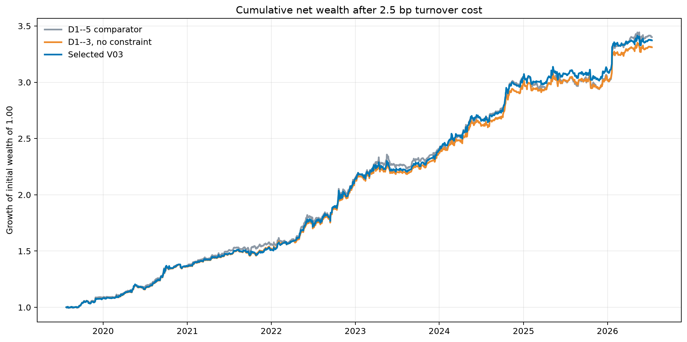
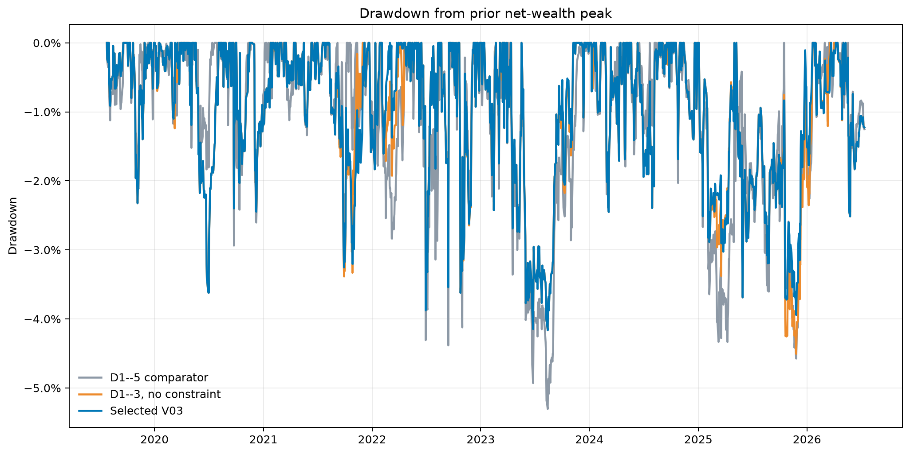

# Henry Hub Natural-Gas Futures Strategy

## Physical Market, Economics, Data, Model, and Historical Results

**Draft date:** August 19, 2026

**Draft status:** Complete research-report draft

**Historical formal model:** `hh_v01_south_central_storage`

**Current selected research model:** `hh_v03_d1_3_storage_guard`

**Instrument:** NYMEX Henry Hub natural-gas futures

**Purpose:** To document the market research, data engineering, signal
construction, strategy development, and historical evaluation completed in
this project.

---

## 0. Executive summary

### 0.1 Objective and economic thesis

This project asks whether point-in-time changes in the physical and economic
state of the U.S. natural-gas system can be converted into a bounded
directional exposure to NYMEX Henry Hub futures. The daily model estimates
bullish or bearish pressure, delays the completed score by one confirmed
trading session, and earns the contract-consistent futures return after a
stated turnover cost.

Henry Hub is a physical delivery node near Erath, Louisiana, rather than a
generic national gas price. Its value reflects the supply, demand, storage
flexibility, and transport capacity that can reach or pull from the connected
Sabine network. The national gas balance defines the broader regime, while
weather revisions, renewable availability, regional power conditions, and
physical disruptions can change the marginal value of gas at the hub.

All directional inputs use the same sign convention: positive is bullish
natural gas and negative is bearish. The strategy uses continuous exposure
rather than a binary long-or-short forecast.

### 0.2 Strategy architecture

The V03 continuous score contains five economically distinct continuous signal
blocks:

| Continuous signal block | Information represented |
|---|---|
| CPC weather revision | Changes in expected heating or cooling demand for matched forecast dates |
| Wind availability | D1--3 expected wind-generation shortfall and the associated call on gas-fired generation |
| Solar availability | D1--5 expected PV-availability shortfall, scaled by daylight |
| Gas fundamentals | South Central storage, production, LNG exports, and net imports |
| EIA-930 regional power | Realized Central and Florida non-gas-generation shortfalls |

The physical-event state is separate from these five continuous blocks.
Production risk and the storage-conditioned wind reversal rule constrain score
formation, while the BSEE/Sabine event control acts afterward as a one-sided
veto on a conflicting short. None of these controls is an additional weighted
signal block, and none can create or enlarge a long position.

The implemented daily sequence is:

```text
five continuous signal blocks
    -> seasonal allocation and funded solar/EIA-930 sleeves
    -> production-risk and wind-reversal constraints
    -> one-session delay and position bound
    -> separate BSEE/Sabine physical-event veto
    -> futures return less turnover cost
```

V03 retains the Central 40% / Florida 60% EIA-930 sleeve, uses D1--3 wind, and
applies the storage-conditioned wind reversal constraint. The position is
bounded to `[-1, 1]`, the futures series rolls five confirmed sessions early,
and daily exposure changes are charged 2.5 basis points per unit.

### 0.3 Selected daily-model result

The selected V03 strategy is evaluated from July 25, 2019 through July 13,
2026 on 1,748 confirmed NYMEX trading sessions:

| Metric | D1--5 comparator | D1--3, no constraint | Selected V03 |
|---|---:|---:|---:|
| Net Sharpe | 2.119 | 2.181 | **2.228** |
| Net Sortino | 3.663 | 3.787 | **3.881** |
| CAGR | **19.20%** | 18.74% | 19.05% |
| Total net return | **240.11%** | 231.09% | 237.22% |
| Maximum drawdown | -5.30% | -4.51% | **-4.16%** |
| Mean absolute position | 10.69% | 10.43% | **10.20%** |

Shortening the wind horizon produces most of the drawdown improvement. The
storage-conditioned constraint then raises Sharpe from 2.181 to 2.228 and
reduces maximum drawdown from -4.51% to -4.16%. The selected model improves
risk-adjusted performance without relying on higher average exposure or a
higher daily win rate, although D1--5 retains slightly higher cumulative
wealth.

The evidence is historical rather than fully prospective. Several V03 choices
were informed by later-period diagnostics, the 2024--2026 observations are
treated as first-look evidence rather than an untouched test, and the fixed
turnover charge is a research convention rather than a complete estimate of
implementation cost.

### 0.4 Subsequent Sabine intraday finding

A subsequent study uses cycle-specific Sabine nomination revisions as a
separate intraday overlay. The retained signal selects the larger absolute
causal revision from TransCameron LNG delivery and Jefferson Island storage
tightness, adds a temporary 10% sleeve after the Intraday 3 posting, and closes
that sleeve at the same contract's settlement-window VWAP.
Although entry and exit usually fall on consecutive calendar dates, both are
inside one NYMEX Globex trading session; “intraday” below refers to that
trading-session clock rather than to one civil calendar day.

On the October 23, 2023--July 13, 2026 active window, the historical comparison
is:

| Metric | Base V03 | Sabine intraday overlay | Same signal, next session |
|---|---:|---:|---:|
| Net Sharpe | 1.960 | **2.454** | 1.332 |
| CAGR | 15.31% | **20.32%** | 10.14% |
| Total net return | 47.36% | **65.44%** | 30.06% |
| Maximum drawdown | -3.94% | **-3.10%** | -7.86% |

The contrast in timing is economically important. The signal performs strongly
between the Intraday 3 posting and settlement, but its incremental return turns
negative when the same information is deferred to the next normal trading
session. The result is therefore consistent with intraday price discovery
following information arrival, not with a persistent next-day fundamental
state.

The overlay remains promising historical evidence rather than a formal V04.
Its paired moving-block bootstrap Sharpe interval is above zero on the existing
sample, but historical specification selection remains relevant and
prospective validation is still required. A longer all-cycle archive and
prospective shadow execution are the next sources of evidence. With broader
cycle, connected-pipeline, capacity, notice, metered-flow, basis, and
executable-price data, the same physical framework can be tested over more
regimes and extended to a wider representation of the connected Henry Hub
system.

---

## 1. What Henry Hub is

### 1.1 Purpose and scope of the physical-market work

The first part of the project established what the name *Henry Hub* refers to
before using it as the economic target of a futures strategy. This required
more than locating Erath, Louisiana, on a map. The research identified the
legal delivery facility, the directly connected pipeline and storage
interfaces, the direction convention used by the operator, the distinction
between structural and operating capacity, and the relationship between the
physical hub and the NYMEX futures contract.

The completed physical-market study used three evidence layers:

| Evidence layer | Sources used | Fact established |
|---|---|---|
| Legal and contractual definition | NYMEX Rulebook Chapter 220, CME contract specifications, FERC orders, and the effective Sabine tariff convention | The contract grade, delivery point, contract quantity, last-trading-day rule, and physical-delivery procedure. |
| Structural network | FERC's market primer, current ONEOK system pages, operator maps, point catalogs, and interconnect lists | Which pipeline, storage, and one-hop corridor connections form the Henry Hub network. |
| Dated operating state | Sabine Electronic Bulletin Board capacity pages, scheduled quantities, cycle timestamps, and critical notices | Which direction and capacity were posted for a specified gas day and nomination cycle. |

The Wave 1 fundamentals study reconciled the pipeline work with the separate
supply, LNG, storage, and power-market research before the network description
was included in this report. Section 1.8 defines the operating measurements;
Section 1.11 lists the completed research artifacts.

### 1.2 The physical delivery node

Henry Hub is a physical natural-gas hub near Erath in Vermilion Parish,
Louisiana. NYMEX Rulebook Chapter 220 defines the delivery point as the piping
and related facilities owned or leased by Sabine Pipe Line, LLC near Erath.
The same rule requires delivered gas to meet the specifications in Sabine's
then-effective FERC-approved tariff. Henry Hub is therefore not merely the
name of a price index or a financially defined pool: the standard NYMEX `NG`
contract is anchored to a named physical facility and its transportation
rules. [NYMEX Rulebook Chapter
220](https://www.cmegroup.com/content/dam/cmegroup/rulebook/NYMEX/2/220.pdf)

The present operator-facing structure is Sabine Pipe Line under ONEOK. ONEOK
completed its acquisition of EnLink in January 2025, and its current Sabine
Hub Services page lists access to ten external pipeline or storage systems:
Acadian, Bridgeline, Columbia Gulf, Gulf South, Jefferson Island Storage &
Hub, Natural Gas Pipeline Company of America, Sea Robin, Southern Natural
Gas, Texas Gas, and Trunkline. Sabine's own mainline forms an additional
internal route through the header and the company's west Louisiana corridor.
[ONEOK Sabine Hub Services](https://www.oneok.com/sabinehubservices)
[ONEOK acquisition announcement](https://ir.oneok.com/news-and-events/press-releases/2025/01-31-2025-140247526)

Operationally, the hub is a header through which nominated gas can be received
from one connected system and delivered into another. Most principal
interfaces have separately posted receipt and delivery directions.

For that reason, the research represented Henry Hub as a node with separate
directional edges:

```text
                           Sea Robin
                               |
                 receipt into Sabine
                               v
Acadian                    <--> |
Bridgeline                 <--> |
Columbia Gulf              <--> |
Gulf South                 <--> |     HENRY HUB /      <--> Sabine mainline
Jefferson Island Storage   <--> +---- SABINE HEADER    <--> local corridor
NGPL                       <--> |
Southern Natural Gas       <--> |
Texas Gas                  <--> |
Trunkline high-pressure    <--> |
Trunkline low-pressure     <--> |
```

Trunkline's high- and low-pressure legs remain separate because they have
different point identifiers. Jefferson Island also remains a distinct direct
storage edge rather than being grouped into Bridgeline. These distinctions
were explicit corrections made during the cross-review of the Wave 1 work.

### 1.3 How the current network was identified

FERC's 2024 *Energy Markets Primer* describes Henry Hub historically as a
physical hub with 12 delivery points, four major receipt points, and more than
a dozen converging pipelines. The primer reproduces a Sabine schematic marked
“Revised: September 2015.” The project used that diagram to establish the
historical structure, then checked the named interfaces against the current
ONEOK Hub Services page, the Sabine system map, operator point catalogs, and
dated EBB postings. [FERC Energy Markets Primer, pp.
20--21](https://www.ferc.gov/sites/default/files/2024-01/24/24_Energy-Markets-Primer_0117_DIGITAL_0.pdf)

This reconciliation explains why the report does not rely on one headline
pipeline count. A count changes depending on whether the Sabine mainline is
included, whether Trunkline's two pressure legs are counted separately, and
whether the unit of observation is a company, system, interconnect, or meter.
The research instead keyed the network to operator names, Sabine location
IDs, receipt/delivery direction, and pressure leg.

The principal direct interfaces identified in the reviewed inventory are:

| Direct interface | Sabine location ID | Posted directions used in the study | Physical role documented by the research |
|---|---:|---|---|
| Acadian | 11203 | Receipt and delivery | Connects the header with the Louisiana intrastate system, Haynesville-access routes, storage, and the Mississippi River industrial corridor. |
| Columbia Gulf | 11202 | Receipt and delivery | Connects Gulf and onshore Louisiana supply with the Columbia Gulf interstate corridor toward Mississippi, Tennessee, Kentucky, and further interconnects. |
| Gulf South | 112564 | Receipt and delivery | Provides a large bidirectional link among Texas and Louisiana supply, Gulf Coast industry, power, utilities, LNG demand, and southeastern markets. |
| Jefferson Island Storage & Hub | 287799 | Receipt and delivery | Directly links Henry Hub to a high-deliverability salt-storage system and its wider multi-pipeline header. |
| Bridgeline | 287439 | Receipt and delivery | Connects the header with a south-Louisiana intrastate network, storage, local markets, and the TransCameron route. |
| NGPL | 44949 | Receipt and delivery | Connects the Louisiana header with NGPL's Texas, Louisiana, storage, Gulf Coast, and Midwest network. |
| Sea Robin | 11204 | Receipt into Sabine | Provides the identified offshore Gulf-to-Erath receipt path. |
| Southern Natural Gas | 46786 | Receipt and delivery | Links Louisiana Zone 0 and the Henry Hub area with southeastern power, industrial, and utility markets. |
| Texas Gas | 42611 | Receipt and delivery fields | Links the Louisiana area with northbound markets including Memphis and the Ohio Valley corridor. |
| Trunkline high pressure | 732835 | Receipt and delivery | High-pressure connection between the header and Trunkline's Gulf Coast and northbound network. |
| Trunkline low pressure | 11200 receipt; 782835 delivery | Receipt and delivery through separate meters | Low-pressure connection retained separately from the high-pressure interface. |

Throughout the chapter, receipt (`R`) means into Sabine/Henry Hub and delivery
(`D`) means out of Sabine/Henry Hub.

### 1.4 Dated capacity snapshot of the direct header

To move from the structural map to operating evidence, the study transcribed
the Sabine Intraday 3 OAC page for gas day February 22, 2026. The table below
reports *operating capacity*, not throughput, in Dth per day. `R` means receipt
into Sabine/Henry Hub and `D` means delivery out of Sabine/Henry Hub.
[Sabine OAC, February 22, 2026, Intraday
3](https://www.gasnom.com/ip/SABINE/oauc.cfm?dt=02%2F22%2F2026&type=1)

| Interface | Operating capacity R | Operating capacity D | What the snapshot establishes |
|---|---:|---:|---|
| Acadian | 200,000 | 135,000 | Both directions had positive posted operating capacity. |
| Columbia Gulf | 130,000 | 280,000 | Both directions had positive posted operating capacity. |
| Gulf South | 500,000 | 500,000 | The point was posted symmetrically in both directions. |
| Jefferson Island | 450,000 | 450,000 | Both the storage-withdrawal/receipt and storage-injection/delivery directions were available at the Henry Hub interface. |
| Bridgeline | 200,000 | 425,000 | Both directions were available, with different posted capacities. |
| NGPL | 640,000 | 640,000 | Both directions had the largest symmetric capacity in this snapshot. |
| Sea Robin | 0 | -- | The listed offshore receipt interface had zero posted receipt operating capacity in this cycle. |
| Southern Natural Gas | 125,000 | 160,000 | Both directions had positive posted operating capacity. |
| Texas Gas | 0 | 400,000 | Delivery was available while receipt operating capacity was zero. |
| Trunkline high pressure | 500,000 | 500,000 | Both high-pressure directions were available. |
| Trunkline low pressure | 130,000 | 130,000 | Both low-pressure directions were available through their separate meter IDs. |

The snapshot adds a dated operating layer to the structural map. Texas Gas
and Sea Robin had zero receipt operating capacity in this cycle, while most
other principal interfaces had positive capacity in both directions. Section
1.8 defines the capacity and schedule fields used in this comparison.

### 1.5 The Sabine mainline and local corridor

The header connects not only to external pipeline companies but also to the
Sabine mainline. The reviewed operator map shows compressor stations at Henry
Hub, Holmwood, and Port Neches, with the line extending west through Kaplan,
Lake Arthur, and the Lake Charles/Holmwood area. The point inventory includes
local industrial deliveries and third-party pipeline receipts along this
corridor, including Westlake, CITGO/EnLink, Calcasieu-area, Trunkline,
HPL/Tejas, and Kinder Morgan-related points. [Sabine system
map](https://www.gasnom.com/ip/sabine/map)

This part of the completed work separated the external Henry Hub header from
the broader Sabine mainline. A delivery to a Lake Charles industrial point is
not a direct Henry Hub interconnect record, even though it can pull gas from
the same operated system. Likewise, a mainline receipt can support a Henry
Hub delivery without appearing as a receipt at one of the external header
points. The separation preserves the physical sequence:

```text
external pipeline or storage interface
    <-> Henry Hub / Sabine header
    <-> Sabine mainline
    <-> local industry, other pipeline receipts, and compressor segments
```

The project used this structure when interpreting Sabine operating events.
Point-specific notices and schedules were assigned to their actual location
and direction instead of treating every Sabine record as a Henry Hub flow.
That location-level treatment is also the basis of the one-sided BSEE/Sabine
event controller described later in the model chapter.

### 1.6 Jefferson Island: the directly connected storage interface

Jefferson Island Storage & Hub is the storage facility most directly tied to
the physical definition of Henry Hub in this research. ONEOK describes it as
a multi-cycle, high-deliverability salt-cavern facility in Vermilion Parish
with a dual-header system. Its published interconnect list includes Columbia
Gulf, Gulf South, Louisiana Intrastate Gas, NGPL, Sabine Pipeline/Henry Hub,
Tennessee Gas, Texas Gas, and Trunkline. [ONEOK Jefferson Island Storage &
Hub](https://www.oneok.com/jish) [ONEOK Jefferson Island
interconnects](https://www.oneok.com/jish/interconnects)

The research verified two separate levels of connectivity:

1. Sabine location 287799 is the direct Jefferson Island--Henry Hub
   interface on the Sabine side.
2. Jefferson Island's wider header connects the storage facility with seven
   other named pipeline systems in addition to Sabine/Henry Hub.

The receipt and delivery signs are defined from Sabine's perspective. A
receipt into Sabine from Jefferson Island normally corresponds to gas being
withdrawn from storage and supplied toward Henry Hub. A delivery from Sabine
to Jefferson Island normally corresponds to gas moving toward injection or
another storage service. The February 22 snapshot posted 450,000 Dth/d of
operating capacity in each direction at the direct interface.

This architecture explains why storage performs more than one market
function. It holds inventory across time, supplies short-run deliverability,
absorbs gas through injection, and connects several pipeline systems through
a flexible header. The project consequently kept four objects conceptually
separate: inventory, injection, withdrawal, and deliverability. Chapter 2
uses that distinction to explain storage economics; Chapter 3 documents the
South Central weekly inventory series used by the current daily model.

### 1.7 Verified one-hop market connections

The direct-header map was extended by one step where primary documents
established a specific route. These one-hop connections are part of the
completed physical interpretation, but they are not counted as additional
direct Henry Hub meters.

#### 1.7.1 Bridgeline--TransCameron--Calcasieu Pass

The clearest route-specific LNG connection identified by the research begins
at the Sabine/Bridgeline Henry Hub meter. In 2020 FERC authorized Sabine to
lease 300,000 Dth/d of firm Bridgeline capacity from the Henry Hub area toward
the TransCameron interconnect. TransCameron then provides the pipeline link to
the Calcasieu Pass LNG facility. The 300,000 Dth/d figure describes the
authorized lease at that time; the dated Sabine OAC fields are used for later
operating snapshots. [FERC authorization, 171 FERC ¶
61,147](https://www.ferc.gov/sites/default/files/2020-06/C-2-052120.pdf)

The verified physical sequence is:

```text
Henry Hub / Sabine
    -> Bridgeline Henry Hub meter
    -> leased Bridgeline path
    -> TransCameron interconnect
    -> Calcasieu Pass LNG feedgas system
```

This work replaced the vague statement that “Gulf Coast LNG is connected to
Henry Hub” with an identified route, meter, operator chain, and direction.
It also kept the direct Bridgeline interface separate from Jefferson Island,
because the two assets connect independently to the Henry Hub header.

#### 1.7.2 Acadian and Haynesville market access

Enterprise's project disclosures document that the Acadian Haynesville
Extension gave Haynesville and Bossier production access to the south
Louisiana system, the Mississippi River industrial corridor, storage, and
physical deliveries into Henry Hub. The Wave 1 work combined that structural
evidence with the direct Acadian--Henry Hub interconnect in the Sabine
inventory. [Enterprise Acadian/Haynesville
announcement](https://ir.enterpriseproducts.com/news-releases/news-release-details/enterprise-products-and-duncan-energy-announce-extension-acadian)

The project recorded this route as a structural production-access corridor
and cross-referenced it to Sabine location 11203 in the direct-interface
inventory.

#### 1.7.3 Interstate market corridors

The direct interconnect inventory was also mapped to each operator's broader
system description:

- Columbia Gulf provides a corridor from Gulf Coast interconnects through
  Louisiana, Mississippi, Tennessee, and Kentucky toward additional Midwest
  systems. [TC Energy Columbia Gulf](https://www.tcenergy.com/operations/natural-gas/columbia-gulf-transmission-pipeline/)
- Gulf South connects supply areas including East Texas and northern
  Louisiana with industrial, utility, power, storage, and LNG markets across
  the Gulf Coast and Southeast. [Boardwalk Gulf
  South](https://bwpipelines.com/subsidiaries/gulf-south-pipeline-company/home)
- NGPL's official segment materials identify its Henry Hub point in the
  Louisiana network and connect that network with Texas, storage, Gulf Coast,
  and Midcontinent/Midwest corridors. [NGPL point
  catalog](https://pipeline2.kindermorgan.com/PortalWeb/PointCatalog.aspx?code=NGPL)
- Southern Natural connects its Louisiana Zone 0 area with southeastern
  power, industrial, and local-distribution markets. [Southern Natural point
  catalog](https://pipeline2.kindermorgan.com/PortalWeb/PointCatalog.aspx?code=SNG)
- Texas Gas connects Louisiana and Gulf supply areas with northbound markets,
  including the Memphis and Ohio Valley corridor. [Boardwalk Texas
  Gas](https://bwpipelines.com/subsidiaries/texas-gas-transmission/home)
- Trunkline publishes separate high- and low-pressure Henry Hub points; the
  project retained this pressure distinction in both the physical map and the
  pipeline inventory. [Trunkline point
  catalog](https://pipelines.energytransfer.com/ipost/point-catalog/location-detail?asset=TGC)

These operator records show why Henry Hub is a national benchmark despite
being a specific Louisiana facility: the delivery node sits inside a broader
network that links producing areas, storage, local industry, Gulf Coast LNG
and power demand, and long-haul interstate markets.

### 1.8 Reading the Electronic Bulletin Board correctly

The physical study collected and interpreted Sabine Electronic Bulletin
Board records rather than treating the operator map as a daily dataset. The
EBB publishes separate rows by gas day, nomination cycle, location, and
direction. The relevant field definitions used throughout the work are:

| Field | Meaning in this project | What it is not |
|---|---|---|
| Design capacity (`DC`) | Operator-posted design quantity for the point and direction. | Daily throughput or guaranteed available space. |
| Operating capacity (`OPC`) | Capacity posted for the dated operating configuration. | A permanent engineering limit. |
| Total Scheduled Quantity (`TSQ`) | Confirmed scheduled quantity after nominations and matching. | SCADA-measured or allocated actual flow. |
| Operationally Available Capacity (`OAC`) | Operator-posted available capacity under the applicable operating and tariff rules. | A field that can always be reconstructed as `OPC - TSQ`. |

Natural-gas scheduling is revised across the Timely, Evening, Intraday 1,
Intraday 2, and Intraday 3 cycles. Nominations submitted on the two sides of
an interconnect are confirmed under pipeline scheduling procedures, and the
posted schedule can change during the gas day. The project therefore retained
the cycle and posting time alongside the gas day.

Three derived quantities were kept distinct:

- `TSQ / OPC`, when operating capacity is positive, is a schedule-intensity
  diagnostic;
- receipts minus deliveries is a scheduled-balance proxy;
- gross receipts plus gross deliveries describes scheduled activity without
  cancelling the two directions.

These are schedule diagnostics, not actual metered throughput or a complete
physical mass balance. Displacement, linepack, compressor fuel, imbalances,
and non-header Sabine points all affect the relationship between nominations
and physical movement.

As part of the completed data work, the project assembled a final/latest
Sabine daily archive covering August 4, 2016 through August 3, 2026 and a
separate cycle-specific panel covering August 19, 2023 through August 18,
2026. The latter contains 231,679 raw OAC rows, 65,040 Henry Hub point-flow
rows, and all five nomination-cycle types. Of its 1,096 gas days, 1,037 contain
the complete five-cycle inventory; the remaining 59 retain the cycles that the
source returned and identify the missing cycle explicitly. These data products
support the measurement definitions, network reconciliation, and future
nomination-revision analysis described in Chapter 6.

### 1.9 What the NYMEX contract represents

The standard NYMEX Henry Hub Natural Gas futures contract has product code
`NG` and is physically deliverable. Its principal specifications are:

| Contract term | Current specification |
|---|---|
| Contract quantity | 10,000 MMBtu, with a permitted delivery tolerance of 2% above or below the trading unit. |
| Price quotation | U.S. dollars and cents per MMBtu. |
| Minimum outright price increment | $0.001 per MMBtu, equal to $10 for one 10,000-MMBtu contract. |
| Contract months | Monthly contracts, with the number of listed months determined by the exchange. |
| Settlement type | Physical delivery at Henry Hub. |
| Termination of trading | The third business day before the first calendar day of the delivery month, subject to the exchange holiday rule. |
| Deliverable gas | Natural gas meeting the then-effective specifications in Sabine Pipe Line's FERC-approved tariff. |

[CME Henry Hub Natural Gas contract
specifications](https://www.cmegroup.com/markets/energy/natural-gas/natural-gas.contractSpecs.html)
[NYMEX Rulebook Chapter
220](https://www.cmegroup.com/content/dam/cmegroup/rulebook/NYMEX/2/220.pdf)

The quantity is an energy amount for the entire delivery month, not a daily
volume of 10,000 MMBtu. Rule 220 requires delivery to begin no earlier than
the first calendar day and finish no later than the last calendar day of the
delivery month, at as uniform an hourly and daily rate as the transporting
pipelines' operating conditions permit. Ignoring the 2% tolerance, one
contract corresponds to an average of about 322.6 MMBtu per day in a 31-day
month, 333.3 MMBtu per day in a 30-day month, or 357.1 MMBtu per day in a
28-day February.

If a position remains open after trading terminates, the contract must be
resolved through the exchange's delivery procedure or through a permitted
exchange-for-related-position transaction. Open short and long clearing
members submit notices identifying the delivering and receiving pipelines.
The Clearing House matches position size and the designated pipeline paths to
the extent possible. Delivery is free on board at the buyer's Henry Hub
interconnection point and can occur by physical flow or displacement; Intra
Hub Transfer service is also recognized as an acceptable buyer
interconnection point. The final settlement price is the price basis for the
delivery.

This contract design ties the financial price to the physical network in a
specific way. A futures position is not a claim on generic U.S. natural gas.
It is a monthly obligation referenced to gas that can satisfy Sabine's quality
requirements and be delivered through acceptable Henry Hub transportation
arrangements.

The backtest in this project does not enter that delivery process. Its
continuous return series moves from the expiring contract to the next contract
five trading sessions before the official last-trading-day convention. The
model therefore studies price exposure to the physically anchored `NG`
contract while closing or rolling the position before delivery notices are
required.

### 1.10 Deliverable capacity and the meaning of scale

The 2024 NYMEX deliverable-supply review provides a separate scale estimate
for the futures contract. Using Sabine's interconnect information, the filing
reported 3,535,000 MMBtu per day of Henry Hub delivery design capacity. At
10,000 MMBtu per futures contract, NYMEX converted that figure to approximately
354 contracts per day and 10,605 contracts over a 30-day month before applying
its conservative deliverable-supply haircut. [NYMEX 2024 Henry Hub
deliverable-supply filing](https://www.cftc.gov/filings/ptc/ptc0926246424.pdf)

The project uses this figure only to describe the scale of the futures delivery
mechanism. The point-level operating and scheduling measures used elsewhere
are defined once in Section 1.8.

### 1.11 Work product from the Henry Hub mapping

The complete 35-file research archive is stored at
[gs://bcli-natgas-data-497807/research/henry_hub_fundamentals/wave1/](https://console.cloud.google.com/storage/browser/bcli-natgas-data-497807/research/henry_hub_fundamentals/wave1).
The principal physical-market artifacts are:

| Artifact | Completed content |
|---|---|
| [physical_network_map.md](https://storage.cloud.google.com/bcli-natgas-data-497807/research/henry_hub_fundamentals/wave1/agent_a_pipeline/physical_network_map.md) | Evidence-tiered direct-header, mainline, storage, pressure-leg, and one-hop topology. |
| [pipeline_inventory.csv](https://storage.cloud.google.com/bcli-natgas-data-497807/research/henry_hub_fundamentals/wave1/agent_a_pipeline/pipeline_inventory.csv) | Sixteen point or corridor records with operator, location ID, direction, capacity snapshot, market role, and source. |
| [pipeline_data_sources.csv](https://storage.cloud.google.com/bcli-natgas-data-497807/research/henry_hub_fundamentals/wave1/agent_a_pipeline/pipeline_data_sources.csv) | Twenty-six pipeline and topology source records with frequency, history, publication method, and timing fields. |
| [pipeline_hypotheses.csv](https://storage.cloud.google.com/bcli-natgas-data-497807/research/henry_hub_fundamentals/wave1/agent_a_pipeline/pipeline_hypotheses.csv) | Twenty-four signed, state-conditioned pipeline and congestion hypotheses used in the Wave 1 research design. |
| [10_wave1_integrated_report.md](https://storage.cloud.google.com/bcli-natgas-data-497807/research/henry_hub_fundamentals/wave1/10_wave1_integrated_report.md) | Reconciled interpretation of the pipeline work with supply, LNG, storage, power, and prior empirical evidence. |

These completed outputs provide the physical vocabulary for the following
chapters. Chapter 2 explains how supply, demand, storage, transport, LNG, and
power conditions affect the price at this node. Chapter 3 then documents the
actual datasets and transformations used to represent those economic forces
in the strategy.

---

## 2. The economics of Henry Hub

### 2.1 The marginal price-setting problem

Chapter 1 defined Henry Hub as a specific physical delivery node. The economic
question is what makes one additional MMBtu at that node more or less valuable.
The answer is the expected balance of supply and demand that can use the
connected system, together with the flexibility available from transport and
storage.

A compact representation is:

$$
\begin{aligned}
NetAvailability_t={}&DeliverableSupply_t+StorageWithdrawal_t
  +InboundTransfer_t\\
&-HeatingDemand_t-PowerDemand_t-IndustrialDemand_t-LNGDemand_t\\
&-StorageInjection_t-OutboundTransfer_t.
\end{aligned}
$$

The spot price adjusts to clear this balance under the operating constraints
prevailing at the time. The futures price reflects the market's expectation
of that marginal value during the contract's delivery month. For a daily
futures strategy, the economically relevant information is therefore usually
a *change in expectation* rather than the already-known level of production,
temperature, storage, or consumption.

This framework separates two questions:

1. **What changes the national or regional gas regime?** Production growth,
   aggregate storage, LNG capacity, imports, exports, and seasonal demand
   describe the broad amount of gas available over weeks or months.
2. **What sets the next marginal Henry Hub value?** A forecast revision,
   power-system shortfall, storage action, outage, or route-specific demand
   change matters through the supply and flexibility available to the delivery
   node at that time.

The national balance and the Henry Hub balance are related but not identical.
National totals combine Canadian imports, several LNG terminals, multiple
Mexico export corridors, different production types, and demand served by
many separate pipeline systems. They describe the overall regime. The local
clearing price depends on the portion of that regime that is economically
deliverable to, or competing with, Henry Hub.

### 2.2 Price anchors rather than one universal price level

The fundamentals work did not impose a single permanent dollar threshold for
“cheap” or “expensive” natural gas. The economically relevant levels are
switching or netback relationships, and each moves with fuel costs, transport,
weather, infrastructure, and the futures curve.

| Price anchor | Economic comparison | Henry Hub implication |
|---|---|---|
| Gas-directed supply | Producer netback versus operating and drilling economics | Sustained higher forward prices support drilling and completions; lower prices slow the medium-run response. |
| Associated-gas supply | Oil-production economics versus the cost of processing, transport, reinjection, or curtailment | Gas output can remain relatively insensitive to Henry Hub when crude economics drive the well. |
| Power-sector switching | Delivered cost of gas generation versus the next available coal, oil, import, storage, or demand-response resource | Gas burn changes when the marginal dispatch comparison changes. |
| LNG feedgas | Destination-market netback versus Henry Hub gas, pipeline transport, liquefaction fuel and fees, and shipping | Feedgas demand is supported when the export netback covers the delivered gas cost, subject to contractual operations. |
| Storage arbitrage | Deferred gas price versus prompt gas plus injection, withdrawal, fuel, financing, and inventory costs | The curve determines whether the marginal MMBtu is injected, held, or withdrawn. |
| Pipeline transport | Regional price difference versus tariff, fuel, and congestion value | Open capacity transmits price changes; binding capacity leaves more of the adjustment in regional basis. |

For power generation, the delivered variable cost of a gas unit can be written
as

$$
MC^{gas}=HeatRate^{gas}\times P^{delivered\ gas}+VOM^{gas}.
$$

If the relevant alternative has marginal cost $MC^{alternative}$, the gas
switching level at the plant is approximately

$$
P^{switch}_{gas}
=\frac{MC^{alternative}-VOM^{gas}}{HeatRate^{gas}}.
$$

The equivalent Henry Hub level is the plant switching value less the basis,
transport, fuel, and distribution costs between Henry Hub and the generator.
Consequently, the same Henry Hub price can produce different dispatch outcomes
across regions and days.

The LNG comparison has a similar structure:

$$
Netback^{HH}_{LNG}
=P^{destination}_{LNG}-Liquefaction-Shipping-Losses-PipelineCost.
$$

When this netback exceeds the marginal cost of acquiring Henry Hub-linked gas,
the export channel has an economic incentive to continue pulling feedgas.
Destination prices, shipping costs, terminal contracts, outages, and available
feeder capacity all move this relationship.

Storage provides a third threshold. Ignoring risk premia for illustration,
injection is economically attractive when

$$
P^{deferred}-P^{prompt}
>InjectionCost+WithdrawalCost+Fuel+Financing.
$$

These three comparisons explain why a fixed Henry Hub price alone does not
identify the marginal buyer or seller. The price must be interpreted relative
to the relevant alternative at that time.

### 2.3 Marginal supply

The supply research divided production by economic type, response horizon,
and transmission channel. This avoids treating every additional unit of U.S.
production as an equivalent daily shock to Henry Hub. The same quantity can
have a different trading interpretation depending on whether it reflects a
months-long producer response, oil-driven associated gas, or an immediate
physical outage.

| Supply source | Production economics | Short-run elasticity and response horizon | Henry Hub transmission identified in the research |
|---|---|---|---|
| Haynesville/Bossier | Predominantly dry, gas-directed production. | Daily output has limited price elasticity; the main response runs from the gas price and forward curve through drilling and completions to supply over subsequent months. | The Acadian system provides documented access to Henry Hub and the Mississippi River industrial corridor. |
| Federal offshore Gulf | Capital-intensive projects whose producing assets do not normally adjust output in response to a daily Henry Hub move. | Very low routine short-run price elasticity, but storms, maintenance, and platform shut-ins can remove supply within hours or days. | Discrete production losses can reach south-Louisiana landing systems and reduce Gulf Coast supply. |
| Permian | A large share of gas is associated with oil production, so crude price and oil activity strongly influence output. | Low short-run elasticity to Henry Hub; gas can continue to be produced while oil economics support the well, until processing, takeaway, reinjection, flaring, or curtailment constraints bind. | Gas first clears through West Texas and Texas Gulf corridors; transport and competing Texas demand determine the Gulf Coast effect. |
| Eagle Ford | Mix of oil-associated, wet-gas, and dry-gas production. | Mixed elasticity: the response horizon depends on the oil, liquids, and dry-gas economics of the relevant acreage and on available gathering and takeaway capacity. | Agua Dulce and other Gulf routes connect production with LNG, Mexico, industry, and the wider Gulf market. |
| Appalachia | Large gas-directed supply with long-haul transport dependence. | Producer response generally operates over a drilling and completion horizon; pipeline constraints can change deliverability immediately even when wellhead production changes slowly. | Southbound pipeline availability determines how much of a production change reaches Gulf Coast markets rather than remaining in Appalachian basis. |
| National production | Aggregates all production types and routes. | Slow, mixed-frequency state variable rather than a uniform daily supply shock. | Provides the total-supply regime and reconciliation benchmark used by the strategy. |

Haynesville is the clearest gas-directed regional supply source in the physical
research. Enterprise's filings document its access through the Acadian system,
while EIA links the basin's activity to natural-gas economics and Gulf Coast
LNG and industrial demand. Higher Henry Hub prices can improve drilling and
completion economics and raise production later; once that production arrives,
it adds supply and can pressure prices lower. This two-way relationship is why
the research distinguished the producer response to prior prices from a new
supply shock. [EIA Haynesville production and market
access](https://www.eia.gov/todayinenergy/detail.php?id=56361)

Permian supply has a different short-run elasticity. Because much of the gas
is produced alongside crude oil, a low gas price does not necessarily stop the
well when oil revenue remains sufficient. The gas can continue entering the
market until processing, takeaway, flaring, reinjection, or curtailment
economics bind. EIA's associated-gas analysis supports using crude activity
and the gas-to-oil relationship when interpreting this supply. [EIA associated
gas economics](https://www.eia.gov/todayinenergy/detail.php?id=52598)

Offshore Gulf production adds another distinction. Its developed supply is
less responsive to a daily Henry Hub price change than gas-directed drilling,
but operating disruptions can remove supply quickly. The project therefore
used BSEE storm shut-in reports as a separately timed physical-event input
rather than treating delayed monthly offshore production as daily news.

This elasticity distinction is reflected directly in the model architecture.
Monthly production describes the slow supply state because drilling,
completion, and aggregate production responses develop over time. BSEE
shut-in reports describe a fast event because they can identify an abrupt
loss of already-producing offshore supply. Both concern production, but they
enter the economic analysis on different clocks.

Across these sources, the main economic variable is *deliverable supply*:
production after gathering, processing, transport, local consumption, and
competing destinations. This concept is narrower than national production but
broader than molecules observed at the Henry Hub header, because displacement
and competition at a shared downstream market can transmit a price effect
without requiring literal passage through the delivery point.

### 2.4 Marginal demand

The demand research separated four economically different consumers: direct
heating load, gas-fired power generation, industrial demand, and export
feedgas. Their timing and willingness to pay are not interchangeable.

#### 2.4.1 Residential and commercial heating

Heating demand responds rapidly to temperature. A colder forecast raises
expected space-heating load, especially during winter when the residential
and commercial system is already operating at a high seasonal rate. The price
effect comes from the forecast revision for the same future dates: it changes
the expected amount of gas that utilities and marketers must schedule or
withdraw from storage.

Extreme cold also acts on supply. Wellhead freeze-offs, processing problems,
compressor constraints, and power interruptions can reduce production or
transport at the same time that heating demand rises. The completed economic
mapping therefore treated the demand increase and the production-risk channel
as distinct contributions to the same tightening event.

#### 2.4.2 Gas-fired power generation

Power burn is determined by residual electric load rather than temperature
alone. A useful accounting approximation is

$$
ResidualLoad
=SystemLoad-NonGasGeneration-NetImports-OtherFlexibleResources.
$$

Hot weather can raise air-conditioning load; cold weather can increase
electric heating and operating stress. Weak wind or solar raises residual
load by reducing renewable output. Coal, nuclear, and hydro outages can have
the same effect. Gas demand rises when gas-fired units are the marginal
resource available to balance that residual.

The project checked the accounting transmission from residual electric load
to gas generation using EIA-930 data. Daily changes in reported gas generation
were regressed on daily changes in residual load with month fixed effects and
HAC standard errors:

| Balancing authority | Observations | Gas-generation association per 1 MWh residual-load change | HAC t | $R^2$ |
|---|---:|---:|---:|---:|
| ERCOT | 2,748 | 0.831 MWh | 167.5 | 0.938 |
| MISO | 2,704 | 0.539 MWh | 106.4 | 0.878 |
| Southwest Power Pool | 2,750 | 0.451 MWh | 91.5 | 0.881 |

Source: [Wave 1 integrated fundamentals
report](https://storage.cloud.google.com/bcli-natgas-data-497807/research/henry_hub_fundamentals/wave1/10_wave1_integrated_report.md),
using EIA-930 daily data through July 13, 2026.

These regressions are an accounting and transmission check, not an independent
predictive or causal validation. Because residual load is constructed by
subtracting non-gas generation and other balancing resources from system
load, it is mechanically close to gas generation plus the remaining balancing
items. The high $R^2$ values therefore partly reflect the electricity-balance
identity.

The results confirm that renewable and other non-gas generation shortfalls
are absorbed materially by gas generation in these systems. They do not by
themselves show that the residual-load change was unexpected, that the
incremental gas burn created an equivalent pipeline-gas demand shock, or that
Henry Hub futures responded. The price-relevant transmission chain is:

```text
unexpected residual-load shock
    -> incremental gas-fired generation
    -> incremental pipeline-gas demand
    -> Henry Hub price response
```

The EIA-930 regression checks the first link in that chain. In the strategy,
EIA-930 is therefore used as a realized regional power-system condition, not
as direct evidence of a Henry Hub price effect. It complements the wind and
solar factors: those factors describe expected renewable availability, while
EIA-930 describes the realized generation mix and non-gas shortfall.

#### 2.4.3 Industrial demand

Industrial gas demand includes process heat, refining, chemicals,
petrochemicals, and other relatively concentrated loads. Much of this demand
changes more slowly than weather-sensitive power burn, but maintenance,
turnarounds, outages, and restarts can create discrete changes. The Sabine
research identified named industrial delivery points along the operated
system, allowing these events to be interpreted as physical demand changes
rather than changes in an undifferentiated state consumption total.

The relevant marginal price is the industrial buyer's value of gas relative
to production schedules, alternate fuels, inventory, and the cost of reducing
output. This makes industrial demand less uniformly weather-driven than
heating or power demand but still important to the local operating balance.

#### 2.4.4 LNG and pipeline exports

LNG feedgas is a large Gulf Coast demand channel because a terminal converts
pipeline gas into a globally transportable product. Its willingness to pay is
linked to destination prices and the export netback described in Section 2.2.
The physical study identified Calcasieu Pass through
Bridgeline--TransCameron as the clearest one-hop Henry Hub-linked LNG route.
Other Gulf Coast terminals compete for overlapping regional supply through
their own feeder systems.

The economic effect of an LNG ramp, outage, or restart is therefore a change
in the competition for connected Gulf Coast gas. Stronger feedgas demand is
upward pressure when the marginal supply would otherwise be available to
Henry Hub, storage, power, or industry. A terminal outage reverses that demand
channel by releasing gas back to the regional market.

Pipeline exports to Mexico were separated by corridor. EIA reports that South
Texas and West Texas accounted for 91% of U.S. pipeline exports to Mexico in
2024. South Texas exports first compete around Agua Dulce and related supply;
West Texas exports first compete with Permian/Waha gas. This geographic split
explains why total U.S. net imports or total Mexico exports are broad regime
measures rather than a single local Henry Hub demand quantity. [EIA Mexico
export corridors](https://www.eia.gov/todayinenergy/detail.php?id=66404)

### 2.5 Storage as inventory, flow, and flexibility

Storage connects prices across time. It permits gas acquired during a loose
period to be injected and held for later withdrawal, while high-deliverability
facilities can respond to short-lived demand or supply shocks.

The completed storage work separated three economic objects:

| Storage object | Economic role | Directional interpretation, all else equal |
|---|---|---|
| Inventory state | Amount of working gas available relative to seasonal requirements | Lower inventory reduces the buffer against future tightening. |
| Injection or withdrawal | Current transfer between the pipeline network and storage | Injection is current demand; withdrawal is current supply. |
| Deliverability | Rate at which inventory can be injected or withdrawn | Higher flexibility limits the price effect of a temporary imbalance. |

These objects can move together without carrying the same signal. A cold shock
can raise prices and cause withdrawal simultaneously. The withdrawal supplies
gas and moderates the shortage even though the observed raw withdrawal is
positively associated with the high-price event. Economically, the relevant
flow is the injection or withdrawal relative to what weather, load, inventory,
and the forward curve already implied.

Salt caverns are particularly important for short-horizon flexibility because
they can cycle more rapidly than many depleted-field facilities. EIA's South
Central analysis documents the region's concentration of salt-cavern capacity
and high withdrawal deliverability, together with its role in balancing LNG
and summer power demand. [EIA South Central storage
analysis](https://www.eia.gov/todayinEnergy/detail.php?id=62724)

This economics led the project to use South Central storage as the regional
state variable and to treat low inventory as an amplifier of a separate fast
shock. Storage alone does not create the selected V03 trade; it changes how
the model responds when a bullish weather or power-system shock conflicts
with a bearish wind contribution.

### 2.6 Transport constraints, basis, and scarcity rent

Transport determines whether a regional supply or demand change reaches Henry
Hub or remains localized. For an upstream location $i$, the relationship can
be written as

$$
P_{HH,t}\approx P_{i,t}+T_{i\rightarrow HH,t}+\lambda_{i,t},
$$

where $T$ is tariff and fuel cost and $\lambda$ is the scarcity value of
the constrained path. When capacity is readily available, arbitrage keeps the
regional price difference close to transport economics. When the path binds,
the basis can widen and the upstream market absorbs more of the shock.

The downstream version works in the opposite direction. A strong downstream
buyer can pull Henry Hub higher when the delivery path is open. If the path is
constrained, the downstream price may rise while the Henry Hub effect is
smaller. FERC's market primer describes transportation access, contract
priority, and congestion as central determinants of regional natural-gas
prices. [FERC Energy Markets
Primer](https://www.ferc.gov/sites/default/files/2024-01/24/24_Energy-Markets-Primer_0117_DIGITAL_0.pdf)

This gives basis a precise economic interpretation:

$$
Basis_{i,HH}=P_i-P_{HH}.
$$

Basis contains transport cost, fuel, losses, local imbalance, and congestion
rent. It shows where the market is clearing and whether a shock is being
absorbed upstream, downstream, or at Henry Hub. Because the Henry Hub price is
one term in the basis calculation, contemporaneous basis is an outcome of the
same price-clearing event; lagged basis describes the pre-existing spatial
state.

The direction of the constrained edge determines the Henry Hub effect:

| Physical change | Immediate economic mechanism | Henry Hub pressure, all else equal |
|---|---|---|
| Loss of an active inbound supply path | Less deliverable supply reaches the node. | Bullish |
| Loss of an active outbound demand path | Gas that would have left the node must find another destination. | Bearish |
| Direct industrial or LNG outage | Connected demand falls and gas is released to the regional market. | Bearish |
| Connected production outage | Deliverable supply falls. | Bullish |
| Lower storage withdrawal capability during a demand shock | Less short-run supply flexibility is available. | Amplifies bullish pressure |

This table is why the research classified events by affected point and
direction. The event type alone is insufficient: a generic “pipeline outage”
does not say whether the lost service was bringing supply in or taking demand
out.

### 2.7 Weather and physical shocks operate through several channels

Weather enters Henry Hub economics through demand, renewable availability,
production, and infrastructure at the same time. The full transmission chain
used in the research is:

```text
weather forecast or revision
    -> heating and cooling load
    -> wind and solar availability
    -> electric residual load and gas-unit dispatch
    -> gas nominations, storage response, and production risk
    -> connected supply-demand balance
    -> Henry Hub price
```

Ordinary cold primarily raises residential and commercial heating demand.
Extreme cold can additionally freeze production and disrupt processing or
transport. Heat raises electric load, but its gas effect depends on which
generators respond and how much renewable and other non-gas generation is
available. Hurricanes can reduce offshore production while also closing LNG,
industrial, or power demand. The completed event research therefore
decomposed each event into supply loss, demand loss, transport state, and
storage response rather than assigning a sign from the weather label alone.

The model implements the same separation. CPC forecast revisions represent
new heating or cooling information. GFS wind and solar represent expected
renewable availability. EIA-930 represents realized non-gas-generation stress.
The BSEE/Sabine controller represents a narrow physical disruption state.
Combining the channels prevents one weather observation from being interpreted
as though it affected only demand or only supply.

### 2.8 Fast information and slow state variables

The final economic distinction is time scale. Some variables move the market
because they reveal new information quickly; others matter because they set
the state in which a fast shock occurs.

| Economic layer | Examples used in the project | Role |
|---|---|---|
| Fast expectation change | Degree-day revision, wind and solar forecast, power-generation shortfall | Changes expected near-term demand or supply substitution. |
| Physical event | Offshore shut-in deterioration, operating notice, route disruption | Changes the available supply, demand, or transport set over a short interval. |
| Weekly flexibility state | South Central inventory and recent injection/withdrawal pattern | Measures the buffer available when a fast shock arrives. |
| Monthly structural state | Production, LNG exports, imports, exports, and consumption balance | Describes the slower supply-demand regime. |
| Seasonal structure | Heating season, cooling season, daylight, and recurring storage cycle | Changes the economic importance of the other economic layers. |

This hierarchy explains the architecture of the selected strategy. Fast
forecast revisions can change the daily direction. Slow variables provide
context and persistence. Low storage amplifies a qualifying fast bullish
shock but does not independently force a position. Seasonal weights recognize
that the marginal use of gas changes through the year. The resulting score is
therefore an estimate of several economically distinct pressures on the same
delivery price, not a forecast derived from one aggregate balance number.

## 3. Data and transformations

### 3.1 Data design and date lineage

The data work converted sources with different clocks into one daily research
panel without treating every observation as if it were known at the same time.
The completed panel is indexed by confirmed NYMEX trading sessions, but each
input retains the date needed to establish when it entered the model.

Four dates are kept conceptually separate:

| Date | Meaning in the research process |
|---|---|
| Observation or reference date | The period described by the value, such as a storage week ending Friday, a production month, an EIA-930 gas day, or a forecast target date. |
| Issue or publication date | The date on which the source released the observation or forecast. |
| Strategy-availability date | The first score date on which the model permits that information to enter under the source-specific timing rule. |
| Held-return date | The following trading session over which the lagged position earns the futures return. |

This distinction is especially important for forecasts. A weather issue has
both an initialization date and several future target dates. A forecast
revision is calculated only after matching the current and previous issues to
the same target dates. It is also important for weekly and monthly data: the
reference period is not the date on which the value becomes tradable
information.

The panel construction follows three rules throughout the active strategy:

1. an observation cannot be joined before its model-availability date;
2. rolling means and standard deviations exclude the current observation; and
3. the completed score is delayed by one trading session before becoming a
   held futures position.

For a source observation $x_k$ with model-availability date $A_k$ and a
trading session $T_j$, the ordinary as-of join is

$$
k(j)=\arg\max_k\{A_k\leq T_j\},
\qquad
x^{panel}_{T_j}=x_{k(j)}.
$$

Thus the panel uses the latest eligible observation and never the latest
reference period merely because that period has ended. When a source has a
maximum permissible age $\ell_s$, the more complete rule is

$$
x^{panel}_{T_j}=
\begin{cases}
x_{k(j)}, & 0\leq T_j-A_{k(j)}\leq\ell_s,\\
NA, & \text{otherwise}.
\end{cases}
$$

For the CPC merge, $\ell_s=3$ calendar days. Wind and solar are accepted only
from complete forecast initializations, while the slower storage and monthly
series use their separate release rules below. Once the component
scores have been formed, the date relationship used by the backtest is

$$
Position_{T_{j+1}}=
\operatorname{clip}\left(Score_{T_j},-1,1\right).
$$

This equation records only the timing link. Chapter 4 defines how the
component scores are weighted and controlled before the lag is applied.

The build also separates source reconstruction from model evaluation. Raw and
processed inputs are identified by immutable Google Cloud Storage object
generations and SHA-256 hashes. The master-panel build validates 72 direct
inputs; the weather build validates 254 monthly GFS partitions and two frozen
capacity snapshots; and the selected-strategy manifest validates 13 compact
score, EIA-930, event, storage-calendar, and capacity objects. The resulting
objects can therefore be traced from a source generation to a daily model
column without re-querying a mutable public endpoint.

### 3.2 Active data inventory

The selected V03 strategy uses the following source groups. The table records
the frequency at which the underlying information is created and the rule
used to admit it to the daily panel.

| Module | Source used in the completed build | Native frequency | Strategy-availability treatment | Model-ready output |
|---|---|---|---|---|
| Seasonal weather | CPC degree-day forecast archive | Forecast issue | Issue and target dates are matched; the resulting score is subsequently subject to the common one-session position lag. | Seasonal HDD, CDD, or GDD forecast revision, plus the pre-`tanh` HDD guard diagnostic |
| Production-disruption risk | Open-Meteo NCEP GFS seamless production-region forecasts and EIA STEO marketed-gas production weights | Forecast issue with monthly weights | Nominal issue date, at most three calendar days old; production weights use a three-month availability proxy | Unbounded local freeze-risk level and same-valid-date revision control scores |
| Wind weather | NCAR GDEX archive of NCEP GFS 0.25-degree forecasts | 00Z initialization with six-hour forecast intervals | Same-day 00Z issue; complete lead, location, and valid-hour inventory required before aggregation | Capacity-weighted D1--3 wind-generation shortfall |
| Wind capacity | U.S. Wind Turbine Database | Turbine/project record | Forecast issue year `y` uses turbines commissioned no later than `y-1` | Annual capacity weights for 28 weather locations |
| Solar weather | NCAR GDEX archive of NCEP GFS radiation and temperature | 00Z initialization with six-hour forecast intervals | Complete D1--5 input grid is aggregated by issue | Capacity-weighted expected PV-availability score |
| Solar capacity | EIA utility-scale operating-capacity history | Monthly | Capacity weights are lagged by two months | Monthly capacity weights mapped to weather locations |
| Storage | EIA Weekly Natural Gas Storage Report | Weekly | Actual WNGSR publication date and time, including audited holiday and special releases | South Central level, one-week change, and four-week change scores, plus the pre-`tanh` level guard diagnostic |
| Gas balance | EIA production, consumption, import, export, and LNG-export histories | Monthly | Reference month `M` becomes eligible at the beginning of `M+3` | Production, LNG, and net-import tightness scores |
| Regional power | EIA-930 balancing-authority demand and generation by fuel | Hourly observations aggregated to gas day | Each completed source gas day maps to the first strictly later strategy score date | Continuous Central/Florida shortfalls and the narrower Central firm non-gas guard diagnostic |
| Physical events | BSEE offshore shut-in reports and Sabine operating notices | Event record | Reports are mapped to the first position interval allowed by the event-timing rule | Post-score short-veto state |
| Futures prices | EIA/CME-derived C1--C4 history and NYMEX near-settlement trades | Trading session | Settlement-to-settlement return convention on the confirmed NYMEX session calendar | Five-session early-roll Henry Hub return |

The daily master panel also retains market, macroeconomic, and diagnostic
columns assembled during the broader research process. These include FRED and
NASA macro series and additional weather and curve features. They remain
separate from the active V03 component set, so their presence in the research
archive does not give them weight in the reported strategy.

### 3.3 Common transformation rules

All active components use a common directional language. Positive values mean
bullish pressure on natural gas; negative values mean bearish pressure. The
raw series is reversed where necessary before it is combined with other
components. For example, low storage, low wind output, low solar output, lower
production growth, higher LNG exports, and a non-gas-generation shortfall all
receive a positive gas-direction sign.

For a value $x_t$ and a rolling reference window of at most $n$ prior
non-missing observations, the general past-only standardization is

$$
\mu_{t,n}=\frac{1}{N_{t,n}}
\sum_{k\in H_{t,n}}x_k,
$$

$$
\sigma_{t,n}=\sqrt{
\frac{1}{N_{t,n}-1}
\sum_{k\in H_{t,n}}(x_k-\mu_{t,n})^2},
\qquad
z_t=\frac{x_t-\mu_{t,n}}{\sigma_{t,n}},
$$

where $H_{t,n}$ contains only observations strictly before $t$ and
$N_{t,n}=|H_{t,n}|$. The exact reference unit matches the native information
frequency:

| Data class | Reference history | Minimum history |
|---|---:|---:|
| CPC issue levels and matched-target revisions | 60 prior issues | 30 issues |
| GFS wind and solar issue scores | 60 prior issues | 30 issues |
| Weekly storage release scores | 104 prior releases | 52 releases |
| Monthly gas-balance scores | 60 prior months | 36 months |
| EIA-930 daily innovations | Prior 252 daily innovations for scale | 126 innovations |

The final transformation depends on the component class:

| Component class | Final component transformation |
|---|---|
| CPC, wind, solar, storage, production/LNG year-over-year, net-import level, and EIA-930 | $Signal_t=\tanh(z_t/2)$ after applying the required economic sign |
| Monthly production, LNG, and net-import-ratio changes | Signed causal z-score, $Signal_t=d\,z_t$, where $d\in\{-1,+1\}$ |
| Physical event state | Boolean eligibility indicator rather than a continuous z-score |
| Futures series | Contract-consistent percentage return rather than a standardized factor |

For the bounded components, `tanh` preserves sign and ordering while limiting
the influence of an extreme standardized observation. The wind build first
clips its z-score to $[-2,2]$; the EIA-930 build clips its raw z-score to
$[-6,6]$. These component-specific caps are shown again with their source
formulas below.

Weekly and monthly variables are standardized before they are carried forward
to daily trading dates. Consequently, a storage release is counted once in
its weekly reference history and a production observation is counted once in
its monthly reference history. Carrying the completed score forward changes
the dates on which the information remains available; it does not create new
independent observations.

### 3.4 CPC seasonal forecast revisions

The CPC transformation measures new information about the same future demand
window. Let $F_{i,d}$ denote the degree-day forecast in issue $i$ for
target date $d$. The revision is constructed from the target dates shared by
successive issues:

$$
Revision_i=\sum_{d\in D_i}
\left(F_{i,d}-F_{i-1,d}\right),
$$

where $D_i$ is the common five-day target set. This prevents the natural
movement of the forecast window through the calendar from being mistaken for
a change in expected weather.

For the seasonally selected degree-day revision, the model-ready CPC value is

$$
z_i^{CPC}=\frac{Revision_i-\mu^{CPC}_{i^-,60}}
{\sigma^{CPC}_{i^-,60}},
\qquad
CPC_i=\tanh\left(\frac{z_i^{CPC}}{2}\right),
$$

where the reference mean and standard deviation use the previous 60 forecast
issues, exclude the current issue, and require at least 30 observations. The
date-only issue is conservatively assigned to the next calendar day as
`signal_available_date`; the ordinary CPC as-of join then permits at most
three calendar days of staleness. The three-slot weather-block scaling is
applied later in Chapter 4.

The active degree-day measure changes with season:

| Calendar months | Active measure | Positive revision means |
|---|---|---|
| October--March | Heating degree days | Colder expected conditions and more heating demand |
| May--September | Cooling degree days | Hotter expected conditions and more cooling demand |
| April | Growing degree days | The continuous shoulder-season degree-day convention used by the historical panel |

The revision is standardized against previous issues only. The selected model
uses `sig_cpc_seasonal_revision`; the archived CPC forecast-level and observed-
weather columns remain in the panel as diagnostics but have zero direct weight
in V03.

### 3.5 Capacity-weighted nonlinear wind factor

The wind build starts from the 00Z NCEP GFS 0.25-degree archive. It uses 28
representative U.S. locations, forecast days 1--5, and the 00, 06, 12, and 18
UTC valid intervals within each forecast day. A forecast issue is admitted to
the daily wind artifact only when the required location, lead, and valid-hour
inventory is complete.

At each location, the 80 m wind components are converted to speed:

$$
v_{80}=\sqrt{u_{80}^{2}+v_{80}^{2}}.
$$

The speed is adjusted to estimated turbine hub height $h$ using

$$
v_h=v_{80}\left(\frac{h}{80}\right)^{0.14}.
$$

The adjusted speed is passed through two explicit functions. The low-to-rated
power curve is

$$
P_0(v)=
\begin{cases}
0, & v<3,\\
\dfrac{v^3-3^3}{12^3-3^3}, & 3\leq v<12,\\
1, & v\geq12.
\end{cases}
$$

The fleet-level high-wind availability multiplier is

$$
A_{high}(v)=
\begin{cases}
1, & v\leq20,\\
\dfrac{1+\cos\!\left(\pi\dfrac{v-20}{5}\right)}{2},
&20<v<25,\\
0, & v\geq25.
\end{cases}
$$

Effective normalized power and gas-supporting shortfall are therefore

$$
P(v)=P_0(v)A_{high}(v),
\qquad
Shortfall(v)=1-P(v).
$$

Capacity weighting is performed after this point-and-valid-hour power-curve
transformation. For a lead set $H$, weather locations $i$, and the four valid
hours $h$ in each lead day $d$, the horizon shortfall is

$$
Q_{t,H}=
\frac{
\sum_{d\in H}\sum_h\sum_i
C_{i,y(t)}\,Shortfall(v_{i,t,d,h})
}{
\sum_{d\in H}\sum_h\sum_i C_{i,y(t)}
}.
$$

For V03, $H=\{1,2,3\}$ and a complete issue therefore contains
$28\times4\times3=336$ location-hour-lead observations. The D1--5 comparator
uses $H=\{1,2,3,4,5\}$.

Each eligible turbine $g$ is assigned to the nearest of the 28 representative
weather locations using the same local-distance approximation as the build:

$$
loc(g)=\arg\min_i\left[
(\phi_g-\phi_i)^2+
\cos^2\left(\frac{\phi_g+\phi_i}{2}\right)
(\lambda_g-\lambda_i)^2
\right],
$$

where $\phi$ and $\lambda$ are latitude and longitude and the cosine is
evaluated in radians. Only turbines with positive capacity and coordinates
inside the configured GDEX bounding box enter this assignment.

For issue year $y$, the annual USWTDB location capacity is

$$
C_{i,y}=\sum_{g:\,loc(g)=i,\;commission(g)\leq y-1}
\frac{t_{\mathrm{cap},g}}{1000},
$$

where USWTDB `t_cap` is converted from kW to MW.

For hub height, let $G^{hh}_{i,y}$ contain eligible turbines assigned to
location $i$ with a reported height, and let $G^{hh}_{y}$ contain all eligible
turbines with a reported height. The implemented local and fleet estimates are

$$
\widetilde h^{local}_{i,y}=
\frac{\sum_{g\in G^{hh}_{i,y}}Capacity_g\,HubHeight_g}
{\sum_{g\in G^{hh}_{i,y}}Capacity_g},
\qquad
\widetilde h^{fleet}_{y}=
\frac{\sum_{g\in G^{hh}_{y}}Capacity_g\,HubHeight_g}
{\sum_{g\in G^{hh}_{y}}Capacity_g}.
$$

The value used for location $i$ is

$$
h_{i,y}=
\begin{cases}
\widetilde h^{local}_{i,y},
& \sum_{g\in G^{hh}_{i,y}}Capacity_g>0,\\
\widetilde h^{fleet}_{y},
& \sum_{g\in G^{hh}_{i,y}}Capacity_g=0
  \text{ and }\sum_{g\in G^{hh}_{y}}Capacity_g>0,\\
80, & \text{otherwise}.
\end{cases}
$$

Thus a location without a reported local height uses the eligible fleet-wide
capacity-weighted height, with 80 m only as the final fallback.

The D1--3 horizon shortfall is standardized over the preceding 60 complete
00Z issues, with at least 30 required:

$$
z^{wind}_t=Z^{causal}_{60}(Q_{t,\{1,2,3\}}),
\qquad
Wind_t=\tanh\left(
\frac{\operatorname{clip}(z^{wind}_t,-2,2)}{2}
\right).
$$

The D1--5 value is retained as the chronological comparison used in the
model-development record.

The selected wind lineage is rebuilt from 127 generation-pinned monthly GFS
objects. The rebuild separately regenerates D1, D1--3, and D1--5 values and
requires exact equality with the compact score input used by the V03 evaluator.

### 3.6 Capacity-weighted solar factor

The solar build uses GFS downward shortwave radiation, two-metre temperature,
and deterministic clear-sky geometry. Each six-hour average radiation value
is converted into surface energy,

$$
E_{6h}=DSWRF\times\frac{6}{1000}
\quad \text{kWh/m}^{2},
$$

and four intervals form the location-level daily total:

$$
E^{surface}_{i,t,d}=\sum_{h\in\{00,06,12,18\}}
DSWRF_{i,t,d,h}\frac{6}{1000}.
$$

For day of year $J$ and latitude $\phi_i$, the implemented FAO-56
extraterrestrial-horizontal-radiation calculation is

$$
d_r=1+0.033\cos\left(\frac{2\pi J}{365}\right),
\qquad
\delta=0.409\sin\left(\frac{2\pi J}{365}-1.39\right),
$$

$$
\omega_s=\arccos\left[
\operatorname{clip}(-\tan\phi_i\tan\delta,-1,1)
\right],
$$

$$
R^a_{i,t,d}=\frac{1}{3.6}
\frac{24\times60}{\pi}(0.0820)d_r
\left[
\omega_s\sin\phi_i\sin\delta+
\cos\phi_i\cos\delta\sin\omega_s
\right].
$$

The division by 3.6 converts MJ/m$^2$/day to kWh/m$^2$/day. Monthly EIA
generator capacity is first mapped to the nearest weather location. For a
plant $g$ and weather location $i$, the build minimizes the monotone haversine
quantity

$$
a_{g,i}=\sin^2\left(\frac{\phi_i-\phi_g}{2}\right)
+\cos\phi_g\cos\phi_i
\sin^2\left(\frac{\lambda_i-\lambda_g}{2}\right),
\qquad
loc(g)=\arg\min_i a_{g,i}.
$$

The capacity history includes positive-capacity operating utility-scale solar
records with coordinate-complete contiguous-U.S. locations. For issue month
$m(t)$, the build uses the capacity month $m(t)-2$:

$$
C^{solar}_{i,t}=\sum_{g:\,loc(g)=i}Capacity_{g,m(t)-2},
\qquad
w^{solar}_{i,t}=\frac{C^{solar}_{i,t}}
{\sum_j C^{solar}_{j,t}}.
$$

For any location-level weather variable $X$, the lead-level capacity-weighted
value is

$$
\overline{X}_{t,d}=
\frac{\sum_{i\in I^{complete}_{t,d}}
C^{solar}_{i,t}X_{i,t,d}}
{\sum_{i\in I^{complete}_{t,d}}C^{solar}_{i,t}}.
$$

Available-capacity coverage is checked as

$$
Coverage_{t,d}=
\frac{\sum_{i\in I^{complete}_{t,d}}C^{solar}_{i,t}}
{\sum_i C^{solar}_{i,t}},
$$

and the lead values are retained only when $Coverage_{t,d}\geq0.995$.
Capacity-weighted surface radiation is then divided by capacity-weighted
extraterrestrial horizontal radiation:

$$
K_{t,d}=\operatorname{clip}\left(
\frac{\overline{E}^{surface}_{t,d}}
{\overline{R}^{a}_{t,d}},0,1.2\right).
$$

The implemented temperature adjustment is

$$
T^{cell}=T_{2m}+0.025\,DSWRF,
$$

$$
\eta_T=\operatorname{clip}
\left[1-0.004(T^{cell}-25),0.75,1.10\right].
$$

Using the capacity-weighted lead-level GFS radiation and temperature values,
the PV-availability proxy is

$$
PVAvail_{t,d}=K_{t,d}\eta_{T,t,d},
\qquad
PVAvail^{1:5}_t=\frac{1}{5}\sum_{d=1}^{5}PVAvail_{t,d}.
$$

The gas-direction input reverses this availability measure. Its complete
transformation is

$$
z^{solar}_t=Z^{causal}_{60}(-PVAvail^{1:5}_t),
\qquad
Solar_t=\tanh\left(\frac{z^{solar}_t}{2}\right),
$$

with at least 30 previous issues required. The separate deterministic
daylight field retained for the model allocation is

$$
DaylightScale_t=\operatorname{clip}\left(
\frac{\frac{1}{5}\sum_{d=1}^{5}\overline{R}^{a}_{t,d}}{10},
0.25,1\right).
$$

### 3.7 Weekly storage and monthly gas fundamentals

The storage build uses EIA South Central Total working gas. Three separate
weekly observations are constructed: the inventory level, the one-week
change, and the four-week change.

For each ISO week, the seasonal level normal is the mean of the previous five
observations for the same week, with at least three prior observations
required. The level deviation is

$$
\overline{S}_{t,w}^{(5y)}=
\frac{1}{N_{t,w}}
\sum_{j\in Y_{t,w}}S_j,
\qquad 3\leq N_{t,w}\leq5,
$$

$$
LevelDeviation_t=\frac{S_t}{\overline{S}_{t,w}^{(5y)}}-1,
$$

where $Y_{t,w}$ contains the previous five available observations for the same
ISO week $w$. The one-week and four-week raw changes are

$$
\Delta_1S_t=S_t-S_{t-1},
\qquad
\Delta_4S_t=S_t-S_{t-4}.
$$

Their same-week innovations are

$$
ChangeInnovation^{(k)}_t=
\Delta_kS_t-
\frac{1}{N_{t,w}}
\sum_{j\in Y_{t,w}}\Delta_kS_j,
\qquad k\in\{1,4\}.
$$

Let

$$
x^{storage}_t\in
\left\{LevelDeviation_t,
ChangeInnovation^{(1)}_t,
ChangeInnovation^{(4)}_t\right\}.
$$

Each gas-direction storage component is

$$
z^{storage}_t=-Z^{causal}_{104}(x^{storage}_t),
\qquad
StorageSignal_t=\tanh\left(\frac{z^{storage}_t}{2}\right),
$$

with at least 52 previous releases required. The negative sign makes low
inventory, weak injection, or strong withdrawal positive for gas.

The alignment uses the actual WNGSR publication calendar rather than a fixed
six-day lag from every week-ending Friday. The usual publication time is
Thursday at 10:30 a.m. Eastern, while the audited calendar also includes the
Wednesday, Friday, and Monday holiday or special releases present in the
sample. The calendar audit changed the score-date alignment on 23 dates in the
selected D1--3 history; those changes are preserved in a dedicated correction
object and are recomputed together with the production clamp and storage
guard.

If $A_t^{WNGSR}$ is the audited publication date of storage observation $t$,
its daily panel value is

$$
StorageSignal_{T_j}^{panel}=
StorageSignal_{\arg\max_t\{A_t^{WNGSR}\leq T_j\}}.
$$

For the 23 dates affected by the holiday-calendar audit, the narrow stored
correction is applied as

$$
Score^{calendar}_j=Score^{legacy}_j+\Delta^{WNGSR}_j,
$$

The correction changes the affected pre-constraint scores and the aligned
South Central storage state. The existing production risk constraint is then
reapplied, and the V03 wind reversal state is recomputed, in the order defined
in Sections 4.3.1 and 4.3.2. The calendar audit therefore changes data timing;
it does not introduce a new model rule.

The monthly block is built from EIA dry production, consumption, imports,
exports, and U.S. aggregate LNG-export volumes. It contains six active
gas-balance transformations:

| Monthly transformation | Calculation before standardization | Gas-direction sign |
|---|---|---|
| Low production growth | Dry-production year-over-year growth | Negative |
| LNG export growth | LNG-export year-over-year growth | Positive |
| Net-import supply | `(imports - exports) / consumption` | Negative |
| Production monthly change | Change in dry-production daily rate | Negative |
| LNG export monthly change | Change in LNG-export daily rate | Positive |
| Net-import-ratio change | Monthly change in the net-import ratio | Negative |

Let $P_m$, $L_m$, $I_m$, $X_m$, and $C_m$ denote monthly dry production, LNG
exports, total imports, total exports, and consumption, and let $d_m$ be the
number of calendar days in month $m$. The raw monthly variables are

$$
ProductionYoY_m=\frac{P_m}{P_{m-12}}-1,
\qquad
LNGYoY_m=\frac{L_m}{L_{m-12}}-1,
$$

$$
NetImportRatio_m=\frac{I_m-X_m}{C_m},
$$

$$
ProductionMoM_m=
\frac{P_m/d_m}{P_{m-1}/d_{m-1}}-1,
\qquad
LNGMoM_m=
\frac{L_m/d_m}{L_{m-1}/d_{m-1}}-1,
$$

$$
\Delta NetImportRatio_m=
NetImportRatio_m-NetImportRatio_{m-1}.
$$

Dividing volumes by calendar days in the two month-over-month formulas
prevents month length from being interpreted as a change in the daily rate.
The signed causal z-scores are

$$
\begin{aligned}
z^{low\_prod}_m&=-Z^{causal}_{60}(ProductionYoY_m),\\
z^{lng\_yoy}_m&=+Z^{causal}_{60}(LNGYoY_m),\\
z^{net\_import}_m&=-Z^{causal}_{60}(NetImportRatio_m),\\
z^{prod\_mom}_m&=-Z^{causal}_{60}(ProductionMoM_m),\\
z^{lng\_mom}_m&=+Z^{causal}_{60}(LNGMoM_m),\\
z^{net\_import\_mom}_m&=-Z^{causal}_{60}(\Delta NetImportRatio_m).
\end{aligned}
$$

Each uses up to 60 prior months with at least 36 required. The production-YoY,
LNG-YoY, and net-import-level components are bounded before entering the
fundamental block:

$$
s_m=\tanh\left(\frac{z_m}{2}\right).
$$

The three month-over-month components enter as their signed z-scores shown
above. Reference month $M$ becomes eligible at the beginning of $M+3$:

$$
A_M^{monthly}=\operatorname{FirstCalendarDay}(M+3),
$$

and its completed score is then aligned by the ordinary backward as-of formula
from Section 3.1.

Together with the three storage variables, these six transformations form the
nine active internal fundamental signals. The archived national-consumption
growth and consumption month-over-month scores are retained with zero weight
in the selected model.

### 3.8 EIA-930 regional power-system signals

The EIA-930 work begins with hourly balancing-authority demand and generation
by fuel and aggregates complete observations to source gas days. The frozen
Florida and Southeast multifuel source contains 49,518 respondent-day records
from January 1, 2019 through July 13, 2026. The separately constructed Central
series and its score-date lineage are retained in the selected EIA-930 overlay.

For balancing authority $b$, source gas day $t$, and fuel $f$, the hourly-to-
daily aggregation is

$$
D_{b,t}=\sum_{h\in t}D_{b,t,h},
\qquad
G^f_{b,t}=\sum_{h\in t}G^f_{b,t,h}.
$$

Demand is admitted only for a complete source day. A blank fuel category for
an otherwise complete respondent-day is treated as zero because the category
represents a technology that the balancing authority does not own or report.

The Central signal aggregates ERCOT, MISO, and Southwest Power Pool. Its
non-gas numerator includes reported wind, solar, coal, nuclear, hydro,
petroleum, geothermal, other-fuel, and unknown-fuel generation. The daily
physical share is

$$
G^{Central,\text{non-gas}}_t=
\sum_{b\in\{ERCO,MISO,SWPP\}}
\sum_{f\in F^{Central}_{\text{non-gas}}}G^f_{b,t},
$$

$$
CentralNonGasShare_t=
\frac{G^{Central,\text{non-gas}}_t}
{\sum_{b\in\{ERCO,MISO,SWPP\}}D_{b,t}}.
$$

The Florida signal uses nine balancing authorities: FMPP, FPC, FPL, GVL, HST,
JEA, SEC, TAL, and TEC. Its numerator is deliberately narrower and contains
coal, nuclear, conventional hydro, and pumped-storage generation:

$$
Water_{b,t}=Hydro_{b,t}+PumpedStorage_{b,t},
$$

$$
G^{Florida,firm}_t=
\sum_{b\in B^{complete}_t}
\left(Coal_{b,t}+Nuclear_{b,t}+Water_{b,t}\right),
$$

$$
FloridaFirmNonGasShare_t=
\frac{G^{Florida,firm}_t}
{\sum_{b\in B^{complete}_t}D_{b,t}}.
$$

Only balancing authorities with a complete source day enter that day's
Florida numerator and denominator. The resulting observation remains in one
continuous Florida history; it is not standardized against a separate history
for each possible respondent subset.

Both regional shares use the same anomaly construction. For each weekday, the
expected value is the mean of the previous eight observations for that
weekday, requiring at least four. The innovation is divided by the standard
deviation of the previous 252 innovations, requiring at least 126. The sign is
reversed and the standardized value is compressed with `tanh(z/2)`, so a
positive signal means an unusually small non-gas share of demand.

Writing either regional share as $q_t$, the calculation is

$$
\overline q^{weekday}_t=
\frac{1}{N_t}\sum_{k\in H^{weekday}_{t,8}}q_k,
\qquad 4\leq N_t\leq8,
$$

$$
Innovation_t=q_t-\overline q^{weekday}_t,
$$

$$
\sigma^{innovation}_t=
\operatorname{SampleStd}
\left(Innovation_{t-1},\ldots,Innovation_{t-252}\right),
$$

$$
z^{power}_t=\operatorname{clip}\left(
-\frac{Innovation_t}{\sigma^{innovation}_t},-6,6
\right),
\qquad
PowerSignal_t=\tanh\left(\frac{z^{power}_t}{2}\right).
$$

Each EIA-930 source gas day maps to the first strictly later strategy score
date. When several weekend source days map to the same Monday score date, the
latest completed source day is retained. The mapping is

$$
ScoreDate(t)=\min\{T_j:T_j>t\},
$$

and, if several source days share one score date,

$$
SourceDay(T_j)=\max\{t:ScoreDate(t)=T_j\}.
$$

The selected power sleeve then uses

$$
EIA930_t=0.40\,Central_t+0.60\,Florida_t.
$$

The separate Southeast audit explains the scale of the Florida system. The
frozen 2019--2026 footprint contains Deep South respondents SOCO, TVA, and
SEPA; Carolinas respondents CPLE, CPLW, DUK, SC, SCEG, and YAD; and the nine
Florida balancing authorities listed above. Within that footprint, the
descriptive ratios are

$$
\frac{\sum FloridaDemand}{\sum SoutheastDemand}=29.2\%,
$$

$$
\frac{\sum FloridaGasGeneration}{\sum SoutheastGasGeneration}=42.6\%,
$$

and

$$
\frac{\sum FloridaGasGeneration}{\sum FloridaDemand}=67.4\%.
$$

These have three different denominators: total Southeast demand, total
Southeast gas generation, and Florida demand. They are descriptive power-
system statistics; the model's 60% Florida weight is the selected blend inside
the fixed EIA-930 sleeve, not Florida's physical share of Southeast demand or
generation.

### 3.9 Constraint-only and shared control inputs

The production clamp and wind-reversal guard use several diagnostics that are
not additional weighted signal blocks. Some are control-only inputs; others
are pre-transformation values or narrower variants of inputs also used in the
continuous score. The exact definitions and implementation columns are:

| Symbol and implementation column | Source | Formula and standardization | Strategy availability | Status in V03 |
|---|---|---|---|---|
| $L_t^{prod}$; `prod_freeze_local_level_score` | Open-Meteo NCEP GFS seamless forecasts for Appalachia, Permian, Haynesville, Bakken, and Eagle Ford, weighted by EIA STEO monthly marketed-gas production lagged three months | Five-day production-weighted local cold severity is transformed with `log1p` and divided by the 95th percentile of the prior 756 transformed observations, requiring 252. It is an unbounded trailing-quantile-scale score, not a z-score or a bounded signal. | Forecast nominal issue date, backward as-of for at most three calendar days; the completed score still receives the common one-session position lag. | Control-only level used by the production clamp and production-revision guard gate. |
| $\Delta_t^{prod}$; `prod_freeze_local_revision_score` | Same weather and production-weight inputs as $L_t^{prod}$ | Same-valid-date change between the current issue's leads 1--4 and the previous issue's leads 2--5; the signed revision is transformed as $\operatorname{sign}(x)\log(1+|x|)$ and divided by the 95th percentile of the absolute transformed revision over the prior 756 observations, requiring 252. It is also an unbounded trailing-quantile-scale score. | Same as $L_t^{prod}$. | Control-only revision used by both asymmetric constraints. |
| $h_t$; `hdd_revision_5d_z` | CPC five-day HDD forecast archive | Past-only causal z-score of the matched-target five-day HDD revision defined in Section 3.4, using 60 prior issues and requiring 30, before the CPC `tanh` transformation. Thus $h_t=1$ means a +1-standard-deviation revision on that causal reference scale. | `signal_available_date = issue_date + 1 calendar day`, backward as-of for at most three calendar days; then the common one-session position lag. | Shared weather diagnostic used by the guard; CDD is not a guard input. |
| $L_t^{storage}$; `south_central_total_level_signal` | EIA South Central Total WNGSR working gas | $L_t^{storage}=-Z^{causal}_{104}(LevelDeviation_t)$, requiring 52 prior releases. This is the pre-`tanh` signed z-score; the continuous storage component is separately $\tanh(L_t^{storage}/2)$. | Actual audited WNGSR publication date and time, then backward as-of; holiday corrections and the common position lag apply. | Shared storage diagnostic used only as an amplifier in the wind guard. |
| Central firm non-gas shortfall; `central_firm_nongas_shortfall` | EIA-930 complete gas-day data for ERCOT, MISO, and Southwest Power Pool | Capacity-unweighted system ratio of coal, nuclear, petroleum, hydro, geothermal, other-fuel, and unknown-fuel generation to demand. The past-eight-same-weekday innovation is divided by the prior-252-innovation standard deviation, sign-reversed, clipped to $[-6,6]$, and transformed as $\tanh(z/2)$. It excludes wind and solar and is therefore narrower than the continuous Central total-non-gas signal. | Source gas day maps to the first strictly later strategy score date; the latest source day is retained when several map to one score date. | Control-only Central firm-generation diagnostic. |
| Florida firm non-gas shortfall; source `florida_firm_nongas_share_shortfall`, evaluated as `signal__firm__florida` | EIA-930 complete gas-day data for the nine Florida balancing authorities in Section 3.8 | Coal plus nuclear plus conventional hydro and pumped storage, divided by demand, with the same past-eight-same-weekday innovation, prior-252 scale, sign reversal, $[-6,6]$ clip, and $\tanh(z/2)$ transformation. | Same strictly-later score-date mapping as the Central diagnostic. | Shared input: the Florida branch of the continuous EIA-930 sleeve and a wind-guard trigger. |

For the production variables, let $c_{r,t,d}$ be local cold severity for
production region $r$, issue $t$, and lead $d$:

$$
c_{r,t,d}=\frac{1}{2}
\left[\frac{q^{mean}_{0.10,r,t,d}-T^{mean}_{r,t,d}}
{IQR^{mean}_{r,t,d}}\right]_+
+\frac{1}{2}
\left[\frac{q^{min}_{0.10,r,t,d}-T^{min}_{r,t,d}}
{IQR^{min}_{r,t,d}}\right]_+.
$$

The seasonal temperature reference uses the previous three complete years
within plus or minus 30 calendar days, requiring 45 observations. Regional
values are weighted by the lagged Lower-48 production shares, and forecast
leads use weights $2^{-(d-1)/2}$. If $\Phi_t$ is the resulting complete D1--5
level and $\Delta\Phi_t$ is its same-valid-date D1--4 revision, the two control
scales can be written as

$$
L_t^{prod}=
\frac{\log(1+\Phi_t)}
{Q_{0.95,t^-}^{756}[\log(1+\Phi)]},
$$

$$
\Delta_t^{prod}=
\frac{\operatorname{sign}(\Delta\Phi_t)
\log(1+|\Delta\Phi_t|)}
{Q_{0.95,t^-}^{756}
[|\operatorname{sign}(\Delta\Phi)\log(1+|\Delta\Phi|)|]}.
$$

Both denominators exclude the current issue. The production weights use a
three-month availability proxy from a revised STEO history rather than an
archived first-vintage series, and the historical availability of the
Open-Meteo forecast reconstruction has not been independently verified. These
limitations are retained in the factor metadata and should be considered when
interpreting the two production controls.

The two firm non-gas guard inputs are already bounded. A strong threshold of
$\tanh(1)$ corresponds to a pre-transformation standardized shortfall of +2,
and a moderate threshold of $\tanh(0.5)$ corresponds to +1. This differs from
$h_t$, $L_t^{storage}$, $L_t^{prod}$, and $\Delta_t^{prod}$, whose guard
thresholds are applied on their unbounded scales specified above.

### 3.10 BSEE and Sabine event records

The physical-event dataset combines dated BSEE offshore gas shut-in estimates
with recent Sabine operational notices. For each BSEE report, the build
calculates the change in reported shut-in volume relative to the prior
tradable report and records whether a relevant Sabine notice occurred within
the preceding three calendar days.

For BSEE report $r$, reported shut-in quantity $Q_r$, and the previous tradable
report $r-1$, the change is

$$
\Delta Q_r=Q_r-Q_{r-1}.
$$

Let $d_r$ be the report date and $d_n$ the date of a relevant Sabine notice.
The recent-notice and rule-eligibility indicators are

$$
RecentNotice_r=
\mathbf{1}\left\{\exists n:0\leq d_r-d_n\leq3
\text{ calendar days}\right\},
$$

$$
Eligible_r=\mathbf{1}\{\Delta Q_r>0\}\times RecentNotice_r.
$$

An event record is eligible when the shut-in estimate worsens and the recent-
notice condition is present. The source report is then mapped to an executable
return date. A report posted on a strategy settlement date can affect the
following settlement-to-settlement interval. A weekend or holiday report is
first advanced to the next settlement date and then controls the following
return interval. The final event registry records the source-report date,
event name, shut-in revision, related notice subjects, entry settlement, and
controlled return date.

With $\mathcal T$ denoting confirmed settlement dates, the mapping is

$$
Entry_r=
\begin{cases}
d_r, & d_r\in\mathcal T,\\
\min\{T\in\mathcal T:T>d_r\}, & d_r\notin\mathcal T,
\end{cases}
$$

$$
ControlledReturnDate_r=
\min\{T\in\mathcal T:T>Entry_r\}.
$$

If more than one eligible report maps to the same controlled return date, the
daily event state and reported shut-in revision are

$$
Event_T=\max_r\left[
Eligible_r\,\mathbf{1}\{ControlledReturnDate_r=T\}
\right],
$$

$$
\Delta Q_T^{event}=\sum_{r:\,ControlledReturnDate_r=T}
Eligible_r\,\Delta Q_r.
$$

This dataset remains outside the continuous factor score. Section 4.3.3
applies the resulting Boolean state as the event risk veto.

### 3.11 Henry Hub futures return series

The futures panel contains the first four NYMEX Henry Hub contract ranks. EIA
official daily settlement values are used through April 5, 2024. Thereafter,
the panel uses a separately labelled near-settlement trade-VWAP proxy derived
from outright NYMEX trades, normally over 2:28--2:30 p.m. New York time. The
source, price type, contract symbol, delivery month, and extraction method are
retained with the price history.

For contract $c$ and the applicable extraction window $W_t$, the proxy is

$$
VWAP_{c,t}=\frac{\sum_{q\in W_t}Price_q\,Volume_q}
{\sum_{q\in W_t}Volume_q}.
$$

The ordinary window is 2:28:00--2:29:59.999 p.m. Eastern. The same formula is
used with the separately labelled expiry, early-close, fallback, or source-gap
window when the ordinary window is not applicable.

The strategy return follows one contract at a time. The official
last-trading-day convention places the last trading day at the third confirmed
NYMEX session before the delivery month. The implemented strategy switches to
the next contract five additional trading sessions before that point. During
the early-roll window, the return is calculated from consecutive C2 prices;
outside that window, it follows consecutive C1 prices, with the contract
identity carried correctly across the official rank change.

Let $L_m$ be the official last trading day for delivery month $m$, defined as
the third confirmed session before the first calendar day of $m$. Let $E_m$ be
the early switch date generated five trading sessions before the official
switch. Define

$$
I^{early}_t=\mathbf{1}\{E_m\leq t<OfficialSwitch_m\}.
$$

The contract-consistent daily return is

$$
r^{futures}_t=
\begin{cases}
\dfrac{C2_t}{C2_{t-1}}-1,
& I^{early}_t=1,\\[6pt]
\dfrac{C1_t}{C2_{t-1}}-1,
& \text{official rank switch on }t,\\[6pt]
\dfrac{C1_t}{C1_{t-1}}-1,
& \text{otherwise}.
\end{cases}
$$

The middle branch links the expiring contract's prior C2 identity to the same
delivery contract after it becomes the new C1, rather than treating the rank
change as a price return.

The session audit removes five 2019 calendar-holiday carry rows that were not
confirmed NYMEX trading sessions. The final `roll_adjusted_return` is therefore
aligned to the same confirmed trading calendar used for score dates, position
lags, turnover, and performance measurement.

### 3.12 Implemented data products

The completed data layer is represented by several linked artifacts:

| Product | Completed content |
|---|---|
| 155-column master panel | Confirmed NYMEX sessions, aligned source dates, daily and slow-frequency features, futures prices, and completeness fields for 8,149 rows through July 17, 2026; the formal evaluation cutoff is July 13. |
| Wind artifacts | 3,857 issue-level daily rows plus annual location weights, fleet diagnostics, and D1/D1--3/D1--5 lineage. |
| Solar artifacts | Issue-level solar signals and 77,225 location-by-lead rows containing radiation, daylight, temperature, and capacity context. |
| EIA-930 artifacts | Frozen respondent-day multifuel source, continuous Florida rolling history, Central/Florida score overlay, respondent coverage, and source-gas-day lineage. |
| Sabine all-cycle OAC archive | 231,679 point-direction-cycle rows from August 19, 2023 through August 18, 2026, plus Henry Hub point flows, cycle summaries, per-day completeness, hashes, retrieval metadata, and an immutable GCS run. |
| Storage timing overlay | The 23 score-date changes produced by the audited WNGSR holiday and special-release calendar. |
| Event registry | BSEE report timing, shut-in revisions, Sabine notice context, and mapped controlled-return dates. |
| Input manifests and schemas | GCS generation, hash, byte size, dimensions, required columns, and Arrow schema fingerprints for the supported reconstruction paths. |

The authoritative inventories are recorded in
[`DATA_MANIFEST.md`](../DATA_MANIFEST.md),
[`master_panel_inputs_2026-07-13.json`](../manifests/master_panel_inputs_2026-07-13.json),
[`weather_factor_inputs_2026-07-28.json`](../manifests/weather_factor_inputs_2026-07-28.json),
and
[`selected_strategy_inputs_2026-08-14.json`](../manifests/selected_strategy_inputs_2026-08-14.json).
Chapter 4 uses these model-ready columns to define weights, constraints, positions,
and the chronological V01--V03 model sequence.

## 4. Model construction and analysis

### 4.1 Model overview

The selected model combines five economically distinct continuous signal
blocks to produce a bounded daily exposure to NYMEX Henry Hub futures. CPC
forecast revisions measure changes in expected temperature-driven demand;
wind and solar forecasts measure expected renewable availability; weekly
storage and monthly gas data describe the condition of the gas system; and
EIA-930 measures the latest realized regional power balance. The model
combines these inputs rather than asking any one variable to represent the
entire gas market.

The calculation can be summarized as:

```text
weather forecasts + renewable availability + gas fundamentals + power balance
    -> seasonally allocated composite score
    -> production-risk and wind-reversal constraints
    -> one-session-delayed, bounded futures exposure
    -> separate BSEE/Sabine physical-event veto
    -> net return after turnover cost
```

The five continuous blocks form the weighted score. The three constraints sit
outside those block definitions and are deliberately asymmetric: they remove a
bearish position when a specified physical risk conflicts with it, but they
never create or enlarge a bullish position. The BSEE/Sabine physical-event
control is therefore not a sixth signal block. A *sleeve* below means a
separately weighted signal allocation within the composite score.

The main notation is:

| Symbol | Model object |
|---|---|
| $W_t$ | CPC weather block |
| $V_t$ | Selected capacity-weighted D1--3 wind shortfall |
| $S_t$ | Capacity-weighted D1--5 solar shortfall |
| $F_t$ | Nine-signal gas-fundamental composite |
| $R_t$ | Central 40% / Florida 60% EIA-930 composite |
| $Q_t^G$ | Score after the production and wind-reversal constraints |
| $P_t$ | Final held futures exposure after the event risk veto |

V03 is the selected research specification, but it should not be interpreted
as a fully pre-specified out-of-sample model. Several later design choices
were informed by later-period diagnostics; the version chronology and sample
treatment are discussed in Section 4.5.

### 4.2 Signal blocks and seasonal allocation

#### 4.2.1 The five continuous signal blocks

The components enter with a common directional interpretation: positive is
bullish natural gas and negative is bearish. Their roles differ by economic
horizon.

| Signal block | Information represented | Role in the daily score |
|---|---|---|
| CPC weather | Revision to the expected heating or cooling requirement for matched forecast dates | Fast demand news |
| Wind | D1--3 capacity-weighted wind-generation shortfall | Expected substitution toward gas-fired generation |
| Solar | D1--5 capacity-weighted PV-availability shortfall | Expected substitution toward gas-fired generation |
| Gas fundamentals | South Central storage, production, LNG exports, and net imports | Weekly flexibility and monthly gas-system state |
| EIA-930 | Realized Central and Florida non-gas-generation shortfalls | Latest observed regional power-system condition |

Only the CPC seasonal forecast revision remains active in the original
three-slot weather structure. CPC forecast level and observed weather are held
at zero so that removing them does not mechanically triple CPC exposure:

$$
W_t=\frac{CPCRevision_t+0_{level}+0_{observed}}{3}.
$$

Thus a 45% nominal weather allocation corresponds to 15% effective CPC
revision exposure; a 22.5% nominal allocation corresponds to 7.5%. The neutral
remainder is part of the formal V03 risk budget, not an unreported signal.

The fundamental composite preserves the slower state variables that remained
useful after the broader feature review. If $f_{k,t}$ is an available
model-ready component and $\alpha_k$ is its internal weight, then

$$
F_t=
\frac{\sum_{k\in\mathcal A_t}\alpha_k f_{k,t}}
{\sum_{k\in\mathcal A_t}\alpha_k}.
$$

| Fundamental group | Components | Combined internal weight |
|---|---|---:|
| South Central inventory | Storage level | $2/11$ |
| South Central flow | One-week and four-week storage changes | $2/11$ |
| Dry production | YoY growth and MoM rate change | $2/11$ |
| LNG exports | YoY growth and MoM rate change | $3/11$ |
| Net imports | Level relative to consumption and MoM ratio change | $2/11$ |

The model began with eleven equal fundamental slots. The two delayed national-
consumption signals were removed because they were slow and overlapped with
weather and power information. Their slots were reassigned to South Central
storage level and LNG-export MoM. Weekly and monthly components are
standardized at their native frequencies before entering this composite, as
described in Chapter 3.

Wind and solar enter as the bounded physical-availability signals constructed
in Sections 3.5 and 3.6. The selected regional power signal is

$$
R_t=0.40\,Central_t+0.60\,Florida_t.
$$

Wind and solar are forward-looking. EIA-930 is backward-looking but timely: it
shows whether the latest completed regional power balance relied unusually
little on non-gas generation. It is used as a realized system condition, not
as direct causal evidence of a Henry Hub price response.

#### 4.2.2 Seasonal allocation and funded sleeves

Gas use changes through the year, so the base score assigns different weights
in peak-demand and shoulder months. Before adding the solar and EIA-930
sleeves, the nominal allocations are 45% weather, 15% wind, and 40%
fundamentals in November--February and June--August; in the remaining months
they are 22.5%, 22.5%, and 55%.

Let $w_{W,t}$, $w_{V,t}$, and $w_{F,t}$ denote those seasonal weights. The base
score is

$$
B_t=w_{W,t}W_t+w_{V,t}V_t+w_{F,t}F_t.
$$

Solar receives a nominal 10% allocation scaled by deterministic daylight,
while EIA-930 receives a fixed 10% allocation:

$$
a_t=0.10d_t,
\qquad
e=0.10.
$$

Both allocations are funded from fundamentals, so they replace part of the
slower gas-state exposure rather than add leverage. Before applying the risk
constraints, the score is

$$
Q_t^{linear}
=w_{W,t}W_t+w_{V,t}V_t
+(w_{F,t}-a_t-e)F_t+a_tS_t+eR_t.
$$

The resulting effective allocation is:

| Season | CPC revision | Neutral weather allocation | Wind | Solar | EIA-930 | Fundamentals |
|---|---:|---:|---:|---:|---:|---:|
| Peak demand | 15.0% | 30.0% | 15.0% | 0--10.0% | 10.0% | 20.0--30.0% |
| Shoulder | 7.5% | 15.0% | 22.5% | 0--10.0% | 10.0% | 35.0--45.0% |

With complete solar context, the daylight floor makes solar's effective
weight 2.5%--10.0%; zero is used only when that context is unavailable. Any
unused nominal solar weight returns to fundamentals. An unavailable wind or
solar update is treated as a neutral zero and does not increase the remaining
weights. Both Central and Florida EIA-930 inputs are required on the V02/V03
common evaluation sample.

### 4.3 Asymmetric risk constraints

The composite score is subject to three restrictions motivated by physical
states in which a bearish position carries a specific asymmetric risk. The
production risk constraint acts while the score is assembled, the wind
reversal constraint acts on the completed D1--3 score, and the event risk veto
acts after the score has become a held position.

#### 4.3.1 Production risk constraint

Winter production disruptions create asymmetric risk for a bearish gas
position. The model therefore prevents a short when local production-
disruption risk is already elevated and not improving. This rule only removes
bearish exposure; it never creates a bullish position.

Let $L_t^{prod}$ be the unbounded local production-risk level score and
$\Delta_t^{prod}$ its unbounded same-valid-date revision score, both on the
trailing-95th-percentile scales defined in Section 3.9. Neither variable is a
raw temperature, a z-score, or a `tanh`-bounded signal. The constraint is
active when

$$
I_t^{prod}=
\mathbf 1\{month(t)\in\{11,12,1,2,3\}\}
\mathbf 1\{L_t^{prod}\geq1\}
\mathbf 1\{\Delta_t^{prod}\geq0\}.
$$

Its action on any intermediate score $x$ is

$$
C_t(x)=
\begin{cases}
\max(x,0), & I_t^{prod}=1,\\
x, & I_t^{prod}=0.
\end{cases}
$$

The restriction is reapplied after each funded sleeve because a newly added
component could otherwise recreate the same prohibited short. The implemented
sequence is

$$
B_t^C=C_t(B_t),
$$

$$
A_t^C=C_t\left[B_t^C+a_t(S_t-F_t)\right],
$$

$$
Q_t^C=C_t\left[A_t^C+e(R_t-F_t)\right].
$$

Outside an active production-risk state, these equations reduce to the linear
allocation in Section 4.2. The audited WNGSR timing corrections described in
Chapter 3 are incorporated before the next constraint is evaluated.

#### 4.3.2 Wind reversal constraint

A bearish wind contribution normally reflects greater expected renewable
generation and less gas-fired power demand. V03 limits that interpretation
when a separate fast bullish shock is already present. If wind alone would
reverse an otherwise bullish score into a short, the model moves to neutral
rather than betting against the physical tightening signal.

The qualifying shocks are:

| Fast-shock family | Strong condition | Moderate condition | Calendar condition |
|---|---:|---:|---|
| Five-day HDD revision, pre-`tanh` causal z-score | $h_t\geq1$ | $h_t\geq0.5$ | Every month except Jun--Aug |
| Local production-risk revision, unbounded trailing-quantile-scale score | $\Delta_t^{prod}\geq1$ | $\Delta_t^{prod}\geq0.5$ | Nov--Mar and $L_t^{prod}>0$ |
| Central or Florida firm non-gas shortfall, bounded $\tanh(z/2)$ signal | signal $\geq\tanh(1)$ | signal $\geq\tanh(0.5)$ | All year |

Here $h_t$ is the matched-target five-day HDD revision on its pre-`tanh`
causal z-score scale, and $\Delta_t^{prod}$ is on the production factor's
unbounded trailing-quantile scale. The power thresholds correspond to
underlying standardized shortfalls of +2 and +1 because those signals have
already been transformed with $\tanh(z/2)$. The Central firm diagnostic
excludes wind and solar and is distinct from the broader Central total-non-gas
signal in the continuous EIA-930 sleeve. CDD is not used in this constraint.

Let $I_t^{strong}$ and $I_t^{moderate}$ indicate that any corresponding fast
shock is present. Let $L_t^{storage}$ denote the **pre-`tanh` signed South
Central storage-level z-score**, $-Z^{causal}_{104}(LevelDeviation_t)$, where a
larger value means lower inventory. The bounded continuous storage component
is $\tanh(L_t^{storage}/2)$, but the guard threshold below is applied to the
unbounded z-score. A shock qualifies when

$$
H_t=I_t^{strong}
\;\lor\;
\left(
\mathbf 1\{L_t^{storage}\geq1\}
\land I_t^{moderate}
\right).
$$

Low storage therefore acts only as an amplifier: it allows a moderate fast
shock to qualify, but it cannot activate the constraint by itself.

Let $Q_t^{-V}$ be the production-constrained score calculated without wind,
and let $Q_t^{1:3}$ be the corresponding score with D1--3 wind. The reversal
condition is

$$
G_t=
H_t
\land\mathbf 1\{V_t<0\}
\land\mathbf 1\{Q_t^{-V}>0\}
\land\mathbf 1\{Q_t^{1:3}<0\}.
$$

The selected score is then

$$
Q_t^G=
\begin{cases}
0, & G_t=1,\\
Q_t^{1:3}, & G_t=0.
\end{cases}
$$

The rule cannot establish or enlarge a long, and it does not alter a short
that was already present before wind was added.

#### 4.3.3 Event risk veto

The BSEE/Sabine event state addresses a narrower execution risk. When a
worsening offshore shut-in estimate coincides with the qualifying Sabine
notice condition defined in Section 3.10, the model does not carry a conflicting
short over the mapped return interval. For a preliminary position $p$, define

$$
\mathcal E_t(p)=
\begin{cases}
0, & E_t^{event}=1\text{ and }p<0,\\
p, & \text{otherwise}.
\end{cases}
$$

This is an event risk veto, not a continuous alpha signal. It leaves long and
neutral positions unchanged.

### 4.4 Position construction and execution

The completed score is delayed by one confirmed NYMEX trading session and
bounded to a unit exposure:

$$
P_t^{pre}=\operatorname{clip}(Q_{t-1}^G,-1,1).
$$

The final position applies the event risk veto to that executable exposure:

$$
P_t=\mathcal E_t(P_t^{pre}).
$$

This order matters economically. The production constraint governs score
formation, the wind constraint compares the score with and without wind, and
the event state is assigned to the return interval on which the position can
actually be held.

The position earns the contract-consistent futures return defined in Section
3.10. Turnover and net return are

$$
Turnover_t=|P_t-P_{t-1}|,
\qquad P_{t_0-1}=0,
$$

$$
r_t^{gross}=P_t r_t^{futures},
$$

$$
r_t^{net}=P_t r_t^{futures}
-0.00025|P_t-P_{t-1}|.
$$

The cost is 2.5 basis points per unit change in model exposure. It does not
separately estimate market impact or impose an additional charge for both
mechanical legs of the monthly roll. $P_t$ is a normalized continuous exposure,
not an integer contract count.

### 4.5 Model development and research protocol

The project retains three formal versions so that later improvements are not
presented as though they had been specified at the beginning.

| Version | Model ID | Main change |
|---:|---|---|
| V01 | `hh_v01_south_central_storage` | Established the seasonal weather, D1--5 wind, daylight-scaled solar, South Central storage and gas-fundamental model, together with the production constraint, position lag, early roll, and turnover cost. |
| V02 | `hh_v02_eia930_central_florida` | Added the 10% Central 40% / Florida 60% EIA-930 sleeve and the BSEE/Sabine event risk veto. |
| V03 | `hh_v03_d1_3_storage_guard` | Replaced D1--5 wind with D1--3 and added the storage-conditioned wind reversal constraint. |

Before these versions were frozen, the research process narrowed a much
broader feature panel. It retained matched-target CPC revisions while leaving
CPC level and observed weather neutral; converted wind and solar forecasts
into capacity-weighted generation proxies; moved weekly and monthly
standardization to the native data frequency; selected South Central Total as
the storage region; removed two overlapping national-consumption signals; and
cleaned the futures calendar and early-roll return. Market, macroeconomic,
curve, and diagnostic variables remain in the archive but do not enter V03.
Final wind and solar allocations were set below their development-grid maxima
to preserve diversification rather than maximize an isolated historical
Sharpe estimate.

The research chronology uses the following labels:

| Split | Dates | Interpretation |
|---|---|---|
| Development | July 3, 2017--December 31, 2020 | Primary feature and weight research for the historical model |
| Validation | January 1, 2021--December 31, 2023 | Fixed-period validation diagnostics |
| First-look | January 1, 2024--July 13, 2026 | Later-period evaluation and failure review |

V02 and V03 begin in 2019 because their common sample requires the EIA-930
overlay. Because several V03 choices, including the regional EIA blend and the
final wind horizon and constraint, were informed by later-period diagnostics,
the 2024--2026 observations are treated as first-look evidence rather than a
fully untouched out-of-sample test. Chapter 5 therefore reports the version
history and subperiod results explicitly instead of attributing the full
historical record to a single predeclared specification.

All exact signal definitions, intermediate states, daily paths, versioned
results, and input manifests are retained in the project repository for
reproducibility. Appendix A records the detailed calculation and artifact
inventory.

## 5. Performance evaluation

### 5.1 Evaluation basis and metric conventions

The evaluation focuses on whether the selected V03 changes improve the return
path in an economically interpretable and stable way. The primary comparison
holds the sample, futures returns, transaction cost, EIA-930 allocation, and
event treatment fixed while changing only the wind horizon and the storage-
conditioned wind constraint.

The common sample runs from July 25, 2019 through July 13, 2026 and contains
1,748 confirmed NYMEX trading sessions. V01's longer 2017-start history is
reported separately because comparing its 1.667 Sharpe directly with the
shorter V03 sample would mix model changes with different dates.

Let $r_t^{net}$ be the daily return defined in Section 4.4 and let
$g_t=\log(1+r_t^{net})$. The reported zero-risk-free-rate Sharpe ratio is

$$
Sharpe=
\frac{\overline g}{s(g)}\sqrt{252}.
$$

Sortino uses the zero-target unconditional lower partial moment:

$$
Sortino=
\frac{252\,\overline g}
{\sqrt{252}\sqrt{\frac{1}{N}\sum_{t=1}^{N}\min(g_t,0)^2}}.
$$

Log returns are retained because they are the frozen convention used to
compare and select the formal model versions and are additive through time.
Changing the convention after selection would restate the evaluation
criterion. For scale, the selected model's arithmetic-return Sharpe is 2.261,
compared with the reported log-return Sharpe of 2.228, so the economic
interpretation is not materially changed. NAV and CAGR remain based on simple
returns because those statistics describe compounded investable wealth.

Positive-return days therefore enter the downside average as zeros. Wealth
and maximum drawdown are calculated as

$$
NAV_t=\prod_{s\leq t}(1+r_s^{net}),
$$

$$
MaximumDrawdown=
\min_t\left(
\frac{NAV_t}{\max\left(1,\max_{u\leq t}NAV_u\right)}-1
\right),
$$

with initial wealth set to one. This convention includes a loss occurring on
the first reported date. CAGR uses the actual first and last settlement
endpoints, and subperiod turnover inherits the position held immediately
before the subperiod begins.

Daily win rate is

$$
WinRate=\frac{1}{N}\sum_{t=1}^{N}\mathbf 1\{r_t^{net}>0\}.
$$

Its denominator includes every reported trading session; zero-return and
flat-position sessions are not removed. Selected V03 has 915 positive-return,
19 zero-return, and 814 negative-return sessions.

### 5.2 Headline common-sample result

The selected model improves risk-adjusted performance and drawdown relative
to the D1--5 comparator while preserving a similar level of cumulative
return.

| Metric | D1--5 comparator | D1--3, no constraint | Selected D1--3 + storage constraint |
|---|---:|---:|---:|
| Net Sharpe | 2.119 | 2.181 | **2.228** |
| Net Sortino | 3.663 | 3.787 | **3.881** |
| CAGR | **19.20%** | 18.74% | 19.05% |
| Total net return | **240.11%** | 231.09% | 237.22% |
| Maximum drawdown | -5.30% | -4.51% | **-4.16%** |
| Annualized downside deviation | 4.82% | 4.56% | **4.52%** |
| Mean absolute position | 10.69% | 10.43% | **10.20%** |
| Daily win rate | 54.06% | 53.78% | 52.35% |
| Total turnover | 117.65 | 123.60 | 124.61 |



*Figure 1. Cumulative net wealth after the 2.5-basis-point turnover charge.
D1--5 ends slightly higher, while the three paths remain close over most of
the sample.*



*Figure 2. Drawdown from the prior net-wealth peak. The selected V03 path
reduces the deepest common-sample drawdown relative to D1--5.*

An initial wealth of 1.00 in the selected backtest grows to approximately 3.37
after the stated turnover charge, compared with approximately 3.40 for the
D1--5 comparator. V03 finishes within 2.89 percentage points of D1--5 in
compounded wealth while producing a shallower drawdown and higher Sharpe and
Sortino ratios.

The selected model is profitable on slightly more than half of trading days.
Its risk-adjusted result comes from the size and sequencing of gains and
losses rather than from a high frequency of positive daily returns.

### 5.3 Attribution of the V03 improvement

The path from D1--5 to selected V03 contains two separate changes. Shortening
the wind horizon from forecast days 1--5 to days 1--3 provides most of the
drawdown reduction. On its own, it raises Sharpe by 0.062 and Sortino by 0.124,
reduces annualized downside deviation by 0.26 percentage point, and improves
maximum drawdown by 0.80 percentage point. The resulting D1--3 path records an
18.74% CAGR and a 231.09% cumulative return before the storage-conditioned
constraint adds its incremental improvement.

The storage-conditioned wind constraint then improves the D1--3 path further:

| Change from unguarded D1--3 | Effect |
|---|---:|
| Sharpe | +0.047 |
| Sortino | +0.094 |
| CAGR | +0.31 percentage point |
| Maximum-drawdown depth | 0.34 percentage point shallower |
| Compounded final wealth | +6.12 percentage points |
| Mean absolute position | -0.23 percentage point |

The constraint changes 59 held-return dates, or 3.4% of the common sample. It
helps on 34 dates and hurts on 25. On the intervention dates it avoids or
reduces 6.49 percentage points of loss and sacrifices 4.66 percentage points
of profit, for a +1.83-percentage-point intervention-date subtotal. Restoring
the unguarded position on later dates adds 0.026 percentage point of relative
turnover cost, while positions and gross returns are otherwise identical on
those restoration dates. The full-path sum of paired daily net-return
differences is therefore +1.81 percentage points after rounding. The +6.12
percentage-point final-wealth difference in the table is larger because it
compares two separately compounded paths; the two quantities are not
interchangeable.

Relative to D1--5, the complete V03 change raises Sharpe by 0.109, raises
Sortino by 0.218, and makes maximum drawdown 1.14 percentage points shallower.
Its CAGR is within 0.15 percentage point and its compounded wealth within 2.89
percentage points of D1--5. The complete change therefore improves the risk-
adjusted return profile while preserving nearly the same terminal wealth.

### 5.4 Stability across periods and years

The selected strategy remains positive in each broad common-sample period and
records a Sharpe ratio above 1.8 in all three. The development row below is the
2019--2020 overlap available to all three variants rather than the longer
2017-start V01 development history.

| Common-sample period | Trading days | D1--5 Sharpe | D1--3 Sharpe | Selected Sharpe | Selected CAGR | Selected max drawdown |
|---|---:|---:|---:|---:|---:|---:|
| Development overlap, 2019-07-25--2020-12-31 | 363 | **2.785** | 2.757 | 2.782 | 24.11% | -3.62% |
| Validation, 2021-01-04--2023-12-29 | 751 | 2.145 | 2.232 | **2.279** | 20.63% | -4.16% |
| First-look, 2024-01-02--2026-07-13 | 634 | 1.718 | 1.779 | **1.835** | 14.48% | -3.94% |
| Full common sample | 1,748 | 2.119 | 2.181 | **2.228** | 19.05% | -4.16% |

V03 is almost unchanged from D1--5 in the short development overlap, while
its larger Sharpe advantage appears in both the validation and first-look
periods. The selected path also maintains a maximum drawdown below 4.2% in
each broad period.

Calendar-year results show positive performance across every reported slice:

| Year | Selected net return | Selected Sharpe | Selected max drawdown |
|---:|---:|---:|---:|
| 2019 partial | 7.83% | 2.710 | -2.33% |
| 2020 | 26.57% | 2.830 | -3.62% |
| 2021 | 10.66% | 1.792 | -3.25% |
| 2022 | 41.43% | 3.270 | -3.88% |
| 2023 | 12.00% | 1.501 | -4.16% |
| 2024 | 27.27% | 3.265 | -2.45% |
| 2025 | 1.63% | 0.234 | -3.94% |
| 2026 through July 13 | 8.98% | 1.981 | -2.51% |

All reported calendar slices are positive in the revised V03 history. The
2025 result illustrates the downside-control objective particularly clearly:
shortening the wind horizon and applying the constraint turn the D1--5 loss of
0.43% into a 1.63% gain and reduce maximum drawdown from 4.57% to 3.94%. The
selected model's 0.234 Sharpe nevertheless remains weak; the modification
reduced damage rather than turning 2025 into a strongly profitable regime.

### 5.5 Exposure, turnover, and execution interpretation

The selected position has a mean absolute value of 10.20%. This is a modest
average normalized exposure, although it can vary daily within the $[-1,1]$
limit. It should not be interpreted as a contract count or as the output of a
fixed-volatility portfolio. The reported CAGR and drawdown belong to this
specific continuous-exposure convention.

Total turnover is 124.61 units over the common sample. At 2.5 basis points per
unit change, the simple accumulated charge is

$$
0.00025\sum_t|P_t-P_{t-1}|
=0.00025\times124.61
\approx3.12\%.
$$

This corresponds to a simple arithmetic average charge of approximately 0.45%
per year over the 1,748-session sample. The charge is already deducted from the
net returns above. The research convention applies this fixed exposure-change
cost consistently to all three model variants. It is a research cost
convention rather than a complete implementation-cost estimate; bid/ask
spread, market impact, financing, and separate mechanical roll costs are not
modeled.

The wind reversal constraint changes 59 return dates, while the final
BSEE/Sabine veto applies on six selected V03 dates. Appendix A.10 reports the
annual distribution and paired net-return contribution of both interventions.

### 5.6 Strength and limits of the evidence

The historical record supports three conclusions. First, the
economic signal architecture can produce positive returns across several gas
and power regimes without maintaining a large average exposure. Second, the
D1--3 wind horizon improves the observed downside path relative to D1--5.
Third, the storage-conditioned constraint adds a smaller incremental benefit
by avoiding wind-driven bearish reversals during qualifying physical-
tightening states.

Together, the subperiod, calendar-year, and intervention results show that the
V03 improvement is aligned with its design. The strategy maintains positive
returns across every reported broad period and calendar slice, improves the
validation and first-look Sharpe ratios relative to D1--5, and reduces the
deepest common-sample drawdown while keeping terminal wealth close to the
comparator.

The improvement is economically consistent but modest relative to D1--5. The
selected specification was informed by multiple historical comparisons, and
no fully prospective sample is yet available after the final V03 design was
frozen.

### 5.7 Overall assessment

V03 is the selected research specification because its improvement is
consistent with its two incremental changes: the shorter D1--3 wind horizon
and the storage-conditioned wind reversal constraint. The production and
BSEE/Sabine constraints remain part of the broader risk architecture, but
they are held fixed in the D1--5-to-V03 attribution. The selected model does
not rely on higher leverage or a higher win rate to obtain the reported Sharpe
improvement.

Across the 1,748-session common sample, V03 delivers a 2.228 net Sharpe, a
3.881 Sortino ratio, a 19.05% CAGR, and a 4.16% maximum drawdown. These results
support the economic coherence of the five continuous signal blocks and are
consistent with the intended role of its asymmetric risk controls. Taken
together, the evidence supports V03 as the project's selected strategy
specification.

## 6. Conclusions and further research

### 6.1 Research conclusion

The project links the physical Henry Hub network to a futures strategy through
a consistent economic chain. Weather changes expected heating and cooling
demand; wind and solar availability affect the call on gas-fired generation;
storage, production, LNG exports, and imports describe the broader gas balance;
and regional power and physical-event data capture operating conditions that
national monthly data cannot represent on their own.

V03 is the selected daily expression of that framework. On the fixed common
sample, shortening the wind horizon from D1--5 to D1--3 produces most of the
downside improvement, while the storage-conditioned wind reversal constraint
adds a smaller incremental benefit. V03 records a 2.228 net Sharpe, a 19.05%
CAGR, and a -4.16% maximum drawdown with a mean absolute position of 10.20%.
These results are consistent with the model's intended design: combine several
physically distinct information sets, keep exposure bounded, and reduce
selected shorts that conflict with fast physical tightening signals.

The subsequent pipeline-nomination study extends the same economic framework
from daily state variables to information arriving within the gas day. Its
result indicates that nomination-cycle revisions can contain useful Henry Hub
information that is no longer visible in final daily pipeline snapshots.

### 6.2 Sabine nomination-revision intraday overlay

Sabine publishes Timely, Evening, Intraday 1, Intraday 2, and Intraday 3
nomination cycles for each gas day. The refreshed all-cycle archive covers
August 19, 2023 through August 18, 2026 and contains 1,096 gas days and 231,679
point-direction-cycle rows. This is a substantial extension of the earlier
90-day engineering cache and makes a multi-season revision study possible.
Scheduled quantity remains a commercial nomination rather than metered flow,
so the retained strategy is interpreted as a response to new scheduling
information.

The final research specification is the **Sabine dominant nomination-revision
intraday overlay**. It uses two revisions with direct economic interpretations:

- TransCameron LNG delivery scheduled quantity from Intraday 1 to Intraday 3;
- Jefferson Island storage tightness, defined as injection minus withdrawal,
  from Timely to Intraday 3.

Each revision is standardized using strictly earlier gas days with a minimum
60-day history. On each eligible date, the larger absolute standardized move
sets the direction of a temporary sleeve:

$$
\Delta P_t=0.10\tanh(z_t^*).
$$

The sleeve enters using the held NG contract's trade VWAP from five to thirty
minutes after the Intraday 3 posting and exits at the same contract's
settlement-window VWAP. Entry and exit are each charged 2.5 basis points per
unit. The overlay does not alter V03's stored daily score or position and is
reported as a separate intraday strategy rather than a formal V04.

This is a same-NYMEX-session trade, not normally a same-calendar-date trade.
Sabine's tariff labels 7:30 p.m. Central as the Intraday 3 quick response and
10:00 p.m. Central as the time by which scheduled quantities are provided;
the native EBB timestamps in the selected sample have a 9:25 p.m. Central
median posting time. A typical ordinary-window trade therefore enters around
9:30--9:55 p.m. Central on calendar date $d$ and exits at 1:28--1:30 p.m.
Central (14:28--14:30 Eastern) on $d+1$. CME Globex trades NG from 5:00 p.m.
to 4:00 p.m. Central, so both legs belong to the session labelled by the exit
date. Actual entry uses each record's native posting timestamp rather than a
fixed tariff time. [Sabine tariff nomination
schedule](https://www.gasnom.com/ip/SABINE/tariff.cfm?page=40)
[CME NG contract specifications](https://www.cmegroup.com/markets/energy/natural-gas/natural-gas.contractSpecs.html)
[CME NG settlement procedure](https://www.cmegroup.com/content/dam/cmegroup/notices/ser/2019/08/SER-8427.pdf)

The active comparison runs from October 23, 2023 through July 13, 2026. It
contains 682 trading sessions and 635 eligible Intraday 3 observations:

| Active-window metric | Base V03 | Intraday overlay | Next-session implementation |
|---|---:|---:|---:|
| Net Sharpe | 1.960 | **2.454** | 1.332 |
| Net Sortino | 3.362 | **4.336** | 2.107 |
| CAGR | 15.31% | **20.32%** | 10.14% |
| Total net return | 47.36% | **65.44%** | 30.06% |
| Maximum drawdown | -3.94% | **-3.10%** | -7.86% |
| Incremental net-return sum | -- | **+1,162.9 bps** | -1,250.4 bps |

The overlay raises Sharpe by 0.493, adds 18.07 percentage points of compounded
wealth, and makes maximum drawdown 0.84 percentage point shallower over the
same dates. Both channels contribute: selected TransCameron observations add
749.8 basis points and selected Jefferson Island observations add 413.1 basis
points on the simple paired-return basis. The result is also positive under
20-, 60-, and 120-day causal standardization histories and remains positive at
assumed costs of 5 and 10 basis points per leg.

A paired moving-block bootstrap of base V03 and overlay returns places the 95%
percentile interval for the Sharpe improvement at approximately [0.043,
0.968], which is above zero but does not remove specification-selection bias
from the historical research process.

Timing is central to the result. Moving the same signal to the next confirmed
session's normal settlement-to-settlement position lowers Sharpe to 1.332 and
produces a negative incremental return. The useful information is therefore
concentrated between the Intraday 3 posting and settlement rather than behaving
like a persistent next-day gas-balance factor.

The complete strategy definition, attribution, figures, and reproducibility
record are retained in the
[`standalone report`](sabine_nomination_revision_intraday_overlay_final.md),
[`research notebook`](../notebooks/08_sabine_nomination_revision_intraday_overlay_final.ipynb),
[`generation-pinned input manifest`](../manifests/sabine_nomination_overlay_inputs_2026-08-19.json),
[`GCS-lineage rebuild pipeline`](../naturalgas/pipelines/rebuild_sabine_nomination_overlay.py),
and [`final result directory`](../results/experiments/sabine_nomination_revision_intraday_overlay_final/).
The rebuild reconstructs the retained revisions from the raw all-cycle Sabine
archive and requires exact parity with the assembled panel. Raw NYMEX ticks
remain controlled data; their pinned processed execution-window parquet is the
exact price-input contract used by the reproduced result.

### 6.3 Opportunities from more complete data

The nomination result strengthens the case for expanding point-in-time
physical data rather than repeatedly reweighting the existing daily panel. A
longer all-cycle Sabine archive, with native posting timestamps and matching
intraday NG trades, would allow the frozen overlay to be tested across more
years, weather regimes, storage states, and market-volatility environments.

Broader data would also allow the same idea to be developed beyond the two
retained points:

| Additional data | Research extension |
|---|---|
| Longer histories for all five Sabine cycles | Extend the current intraday backtest and measure performance across a wider range of gas-market regimes. |
| Matching nominations from connected pipelines | Confirm whether a revision represents a real path-level change on both sides of an interconnect. |
| Historical capacity, OAC, and notice vintages | Distinguish ordinary schedule changes from revisions occurring when the relevant route is constrained. |
| Storage inventory, deliverability, and connected schedules | Refine the Jefferson Island signal by conditioning revisions on the facility's ability to inject or withdraw. |
| LNG feeder, industrial-meter, plant, and fuel-burn data | Identify which delivery revisions represent incremental gas demand that can transmit to Henry Hub. |
| Metered flow, basis prices, and executable futures quotes | Confirm that scheduled changes became physical and measure the location and implementation cost of the response. |

These datasets are complementary: nominations show the commercial update,
capacity and notices describe the network's ability to absorb it, metered flow
shows whether it became physical, and basis or futures prices show where the
market response occurred. Given the strength and timing specificity of the
current two-channel result, a longer history and wider connected-network
coverage should support additional useful signals and a more complete
intraday representation of the Henry Hub system.

## Appendix A. Detailed model specification and research record

### A.1 Exact calculation order

This appendix preserves the exact implementation sequence behind Chapter 4.
It begins with the model-ready variables from Chapter 3, whose signs already
have a common meaning: positive is bullish natural gas and negative is
bearish. The additional detail below records intermediate scores, exceptions,
variable status, retained research decisions, and repository artifacts for
audit and reproduction.

The implemented order is:

```text
model-ready CPC, wind, solar, fundamental, and EIA-930 signals
    -> internal weather and fundamental blocks
    -> peak-demand or shoulder-season allocation
    -> winter production risk constraint on the seasonal base score
    -> solar sleeve funded from fundamentals, then constraint re-applied
    -> EIA-930 sleeve funded from fundamentals, then constraint re-applied
    -> V03 storage-conditioned wind reversal constraint
    -> score delayed by one confirmed NYMEX trading session
    -> position clipped to [-1, 1]
    -> BSEE/Sabine event risk veto
    -> contract-consistent futures return
    -> turnover cost
```

The principal notation used below is:

| Symbol | Model object |
|---|---|
| $W_t$ | Fixed three-slot CPC weather block |
| $V_t^{1:3}$ | Selected capacity-weighted D1--3 wind signal |
| $V_t^{1:5}$ | Earlier D1--5 wind comparator |
| $S_t$ | Capacity-weighted D1--5 solar signal |
| $F_t$ | Nine-signal natural-gas fundamental block |
| $R_t$ | Selected Central 40% / Florida 60% EIA-930 signal |
| $Q_t$ | Composite score before the V03 wind reversal constraint |
| $Q_t^G$ | Composite score after the V03 wind reversal constraint |
| $P_t$ | Final held futures position after the event risk veto |

### A.2 Component definitions

#### A.2.1 Fixed CPC weather block

The historical weather architecture contained three equal direct slots:
seasonal CPC forecast revision, CPC forecast level, and observed weather. The
research retained only the forecast revision. The other two slots were set to
zero rather than removed from the denominator:

$$
W_t=\frac{CPCRevision_t+0_{level}+0_{observed}}{3}.
$$

Here $CPCRevision_t$ is the bounded, seasonally selected signal defined in
Section 3.4. Keeping the denominator at three prevents removal of two unstable
features from mechanically tripling the remaining CPC exposure. It also means
that the nominal top-level weather allocation is not the same as the effective
weight on CPC revision: CPC receives one-third of that block and the other two
thirds remain neutral.

Forecast revision was retained because it represents a change in expected
future demand for matched target dates. Direct forecast level and observed
weather remain available as diagnostics but receive no direct position weight.

#### A.2.2 Fundamental block

The final fundamental block contains nine active signals. Let $f_{k,t}$ be the
model-ready value of active component $k$ after the transformations in Chapter
3, and let $\alpha_k$ be its internal weight. The block is

$$
F_t=
\frac{\sum_{k\in\mathcal A_t}\alpha_k f_{k,t}}
{\sum_{k\in\mathcal A_t}\alpha_k},
$$

where $\mathcal A_t$ is the set of active fundamental components available on
date $t$. The supported evaluation applies readiness checks before admitting a
return. Within the fundamental builder, however, the denominator is explicitly
the available internal weight. This differs from the fixed neutral-slot policy
used for missing wind and solar observations.

The selected internal weights are:

| Fundamental component | Internal weight | Current role |
|---|---:|---|
| South Central storage level | 18.18% ($2/11$) | Low inventory receives the first reassigned slot. |
| South Central one-week change | 9.09% ($1/11$) | Measures recent weekly tightening. |
| South Central four-week change | 9.09% ($1/11$) | Measures persistent weekly tightening. |
| Low dry-production YoY growth | 9.09% ($1/11$) | Slow supply state. |
| LNG-export YoY growth | 9.09% ($1/11$) | Structural export-demand state. |
| Net-import supply | 9.09% ($1/11$) | Domestic external-supply state. |
| Dry-production MoM | 9.09% ($1/11$) | Recent production-rate change. |
| LNG-export MoM | 18.18% ($2/11$) | Receives the second reassigned slot. |
| Net-import-ratio MoM change | 9.09% ($1/11$) | Recent external-supply change. |
| National consumption YoY and MoM | 0% | Retained only as archived diagnostics. |

The research began with eleven equal fundamental slots. National consumption
YoY and MoM were removed from the direct daily position because the delayed
national aggregates were slow and overlapped substantially with weather and
power information. The two released $1/11$ slots were reassigned through a
development-only candidate comparison. Candidates within 0.01 Sharpe of the
development maximum were shortlisted, and the lowest-turnover candidate in
that shortlist assigned the extra slots to South Central storage level and LNG
export MoM.

#### A.2.3 Wind, solar, and regional power blocks

The selected wind input is $V_t^{1:3}$, the D1--3 bounded shortfall signal from
Section 3.5. D1--3 describes forecast leads, not a holding period. The earlier
$V_t^{1:5}$ signal is retained only as a controlled model comparator.

The active solar value $S_t$ is the bounded D1--5 PV-availability shortfall
from Section 3.6. Its top-level weight varies with deterministic daylight but
its internal signal formula does not change by season.

The EIA-930 sleeve is

$$
R_t=0.40\,Central_t+0.60\,Florida_t.
$$

This is one regional power-system block, not two additional top-level factors.
It complements the forecast factors: wind and solar describe expected future
renewable availability, while EIA-930 describes the latest admitted realized
generation mix.

### A.3 Seasonal allocation and sleeve funding

The base allocation changes between peak-demand and shoulder months:

| Season | Months | CPC weather block | Wind | Fundamentals before sleeve funding |
|---|---|---:|---:|---:|
| Peak demand | Nov--Feb and Jun--Aug | 45.0% | 15.0% | 40.0% |
| Shoulder | Mar--May and Sep--Oct | 22.5% | 22.5% | 55.0% |

Let $w_{W,t}$, $w_{V,t}$, and $w_{F,t}$ denote the applicable row. Before
solar and EIA-930 funding, the score is

$$
B_t=w_{W,t}W_t+w_{V,t}V_t+w_{F,t}F_t.
$$

The wind horizon in $B_t$ is D1--3 for the selected V03 score and D1--5 for
the comparator. All other terms are held fixed in that comparison.

The deterministic daylight scale from Chapter 3 is $d_t$. With complete solar
context it lies in $[0.25,1]$; if that context is unavailable, the
implementation fills it with zero. The effective solar allocation is

$$
a_t=0.10\,d_t.
$$

The EIA-930 allocation is fixed at

$$
e=0.10.
$$

Both sleeves are funded from the fundamental allocation rather than added as
leverage. Ignoring the one-sided production control for a moment, the linear
allocation identity is

$$
Q_t^{linear}
=B_t+a_t(S_t-F_t)+e(R_t-F_t),
$$

or equivalently,

$$
Q_t^{linear}
=w_{W,t}W_t+w_{V,t}V_t
+(w_{F,t}-a_t-e)F_t+a_tS_t+eR_t.
$$

This identity makes the funding mechanics explicit; it is not intended to
replace the sequential constraint equations in Section A.4. A larger daylight
scale moves more of the fixed seasonal fundamental budget into solar. A
smaller daylight scale returns the unused nominal solar allocation to
fundamentals. The EIA-930 slot always removes exactly 10 percentage points from
fundamentals on admitted score dates.

| Season | CPC weather | Wind | Solar | EIA-930 | Fundamentals after funding |
|---|---:|---:|---:|---:|---:|
| Peak demand | 45.0% | 15.0% | 0--10.0% | 10.0% | 20.0--30.0% |
| Shoulder | 22.5% | 22.5% | 0--10.0% | 10.0% | 35.0--45.0% |

On dates with complete daylight context, the solar floor makes its effective
weight 2.5%--10.0%; zero occurs only when the daylight context itself is
unavailable. Missing wind or solar values occupy a neutral zero slot and do
not increase the remaining top-level weights. The selected V02/V03 common
sample requires both Central and Florida EIA-930 inputs to be present.

### A.4 Winter production risk constraint

The production control is a one-sided safety rule. Let $L_t^{prod}$ be the
unbounded local production-freeze level score and $\Delta_t^{prod}$ its
unbounded same-valid-date revision score. Both use the trailing-756-observation
95th-percentile scales in Section 3.9; they are not z-scores or bounded
signals. The control state is

$$
I_t^{prod}=
\mathbf 1\{month(t)\in\{11,12,1,2,3\}\}
\mathbf 1\{L_t^{prod}\geq1\}
\mathbf 1\{\Delta_t^{prod}\geq0\}.
$$

Define the control operator

$$
C_t(x)=
\begin{cases}
\max(x,0), & I_t^{prod}=1,\\
x, & I_t^{prod}=0.
\end{cases}
$$

The rule prevents a short when the estimated local production-disruption level
is already high and is not improving. It cannot create a positive score: a
negative value becomes zero, a zero remains zero, and a positive value is
unchanged.

Because the solar and EIA-930 sleeves were added at successive research
stages, the implemented score reapplies the same operator after each layer.
For wind horizon $h\in\{1{:}5,1{:}3\}$, the exact sequence is

$$
B_{t,h}^{C}=C_t(B_{t,h}),
$$

$$
A_{t,h}^{C}
=C_t\left[B_{t,h}^{C}+a_t(S_t-F_t)\right],
$$

$$
Q_{t,h}^{C}
=C_t\left[A_{t,h}^{C}+e(R_t-F_t)\right].
$$

Thus the funding weights in Section A.3 still sum to one, while the safety
operator can truncate a negative intermediate score during an active winter
production-risk state. Outside that state, $C_t(x)=x$ and the sequence reduces
exactly to $Q_t^{linear}$. On one of the 23 WNGSR calendar-correction dates,
the stored score is updated as $C_t(Q_{t,h}^{C}+\Delta_t^{WNGSR})$ and the
subsequent V03 guard is recomputed.

### A.5 V03 storage-conditioned wind reversal constraint

V03 adds a second one-sided rule after the production control. Its purpose is
narrower: it prevents a bearish D1--3 wind contribution from reversing an
otherwise bullish score when a qualifying fast bullish shock is present.

Three fast-shock families are used:

| Trigger family | Strong threshold | Moderate threshold | Calendar condition |
|---|---:|---:|---|
| Five-day HDD forecast revision, pre-`tanh` causal z-score | $h_t\geq1$ | $h_t\geq0.5$ | Every month except Jun--Aug |
| Local production-risk revision, unbounded trailing-quantile-scale score | $\Delta_t^{prod}\geq1$ | $\Delta_t^{prod}\geq0.5$ | Nov--Mar and $L_t^{prod}>0$ |
| Central or Florida firm non-gas shortfall, bounded $\tanh(z/2)$ signal | signal $\geq\tanh(1)$ | signal $\geq\tanh(0.5)$ | No additional month gate |

Here $h_t$ is the pre-`tanh` HDD causal z-score, while
$\Delta_t^{prod}$ is the production factor's unbounded trailing-quantile-scale
score. The firm non-gas thresholds correspond to raw standardized shortfalls
of +2 and +1 respectively because those power signals have already been
transformed as $\tanh(z/2)$. The Central guard diagnostic is the retained
`central_firm_nongas_shortfall` input; it is distinct from the broader Central
total-non-gas value used inside the continuous EIA-930 sleeve. CDD is not a
guard input.

Let $I_t^{strong}$ indicate that any strong trigger is present and let
$I_t^{moderate}$ indicate that any moderate trigger is present. Let
$L_t^{storage}$ be the **pre-`tanh` signed South Central storage-level
z-score**, $-Z^{causal}_{104}(LevelDeviation_t)$, for which a larger positive
value means lower inventory. The corresponding continuous storage component
is $\tanh(L_t^{storage}/2)$; the threshold below acts on the unbounded z-score.
The qualifying state is

$$
A_t=I_t^{strong}
\;\lor\;
\left(
\mathbf 1\{L_t^{storage}\geq1\}
\land I_t^{moderate}
\right).
$$

Low storage therefore cannot activate the guard alone. It only allows a
moderate fast shock to qualify as if it were strong.

Let $Q_t^{-V}$ be the production-controlled score constructed without the
D1--3 wind contribution and let $Q_t^{1:3}=Q_{t,1:3}^{C}$ be the
production-controlled D1--3 score before this guard. The
guard intervenes only when all four conditions hold:

$$
G_t=
A_t
\land\mathbf 1\{V_t^{1:3}<0\}
\land\mathbf 1\{Q_t^{-V}>0\}
\land\mathbf 1\{Q_t^{1:3}<0\}.
$$

The selected score is

$$
Q_t^G=
\begin{cases}
0, & G_t=1,\\
Q_t^{1:3}, & G_t=0.
\end{cases}
$$

This rule has three deliberate limits. It cannot create or enlarge a long; it
cannot change a short that was already present without wind; and it cannot be
activated by low storage without a contemporaneous qualifying fast shock.

### A.6 From score to final position and net return

After the selected score is complete, it is delayed by one confirmed NYMEX
trading session and bounded:

$$
P_t^{pre}=
\operatorname{clip}(Q_{t-1}^G,-1,1).
$$

The BSEE/Sabine event state from Section 3.10 is then applied to the held-return
date. Let $E_t^{event}$ be its Boolean value. The final position is

$$
P_t=
\begin{cases}
0, & E_t^{event}=1\text{ and }P_t^{pre}<0,\\
P_t^{pre}, & \text{otherwise}.
\end{cases}
$$

The event controller is therefore a pure short veto. It does not enter the
continuous score, establish a long, enlarge a long, or change a non-conflicting
position.

Turnover is absolute daily position change, with the pre-sample position taken
as zero:

$$
Turnover_t=|P_t-P_{t-1}|,
\qquad P_{t_0-1}=0.
$$

Using the contract-consistent futures return from Section 3.11, daily gross and
net strategy returns are

$$
r_t^{gross}=P_t r_t^{futures},
$$

$$
r_t^{net}=P_t r_t^{futures}
-0.00025|P_t-P_{t-1}|.
$$

The 2.5 basis-point rule charges changes in model exposure. It does not
separately estimate bid/ask spread, market impact, or both mechanical legs of
the monthly contract roll. The position is a continuous normalized exposure,
not a literal integer contract count.

### A.7 Why the order of constraints matters

The controls are not interchangeable. The implemented order can be summarized
as follows:

| Step | Operation | Can create a long? | Can remove a short? |
|---:|---|---:|---:|
| 1 | Construct seasonal CPC, wind, and fundamental base | Yes, through signed information | Yes |
| 2 | Apply the production clamp to the base and again after each funded sleeve | No | Yes, by setting a negative intermediate score to zero |
| 3 | Apply V03 storage-conditioned wind guard | No | Yes, only for a qualifying wind-driven sign reversal |
| 4 | Lag one session and clip to $[-1,1]$ | No new information | Preserves the score direction subject to bounds |
| 5 | Apply BSEE/Sabine event veto | No | Yes, for a conflicting held short |

Moving the event veto before the lag would assign the event to a different
return interval. Applying the storage guard before constructing the D1--3 wind
score would make it impossible to test whether wind actually caused the sign
reversal. Applying solar or EIA-930 as additive leverage would change the
seasonal risk budget. The stored daily artifacts retain the intermediate
scores and flags needed to audit this order.

### A.8 Condensed research log

The detailed notebooks and intermediate artifacts preserve the candidate
grids. The decisions needed to interpret the final specification are:

| Research question | Retained decision |
|---|---|
| Which direct weather observations remain active? | Keep matched-target CPC revision; leave CPC level and observed weather in neutral fixed slots. |
| How should renewable availability be represented? | Use capacity-weighted nonlinear D1--3 wind and daylight-scaled D1--5 PV availability. |
| At what frequency should slower variables be standardized? | Standardize storage on weekly releases and gas-balance variables on monthly observations before daily alignment. |
| Which storage and fundamental specification is used? | Use South Central Total for all three storage signals; remove national-consumption signals and reassign their slots to storage level and LNG-export MoM. |
| How are regional power and physical events represented? | Use the Central 40% / Florida 60% EIA-930 sleeve and a separate BSEE/Sabine event risk veto. |
| Which execution conventions are retained? | Use confirmed NYMEX sessions, the five-session early roll, a one-session signal delay, and the stated turnover cost. |
| How were the final renewable weights interpreted? | Retain wind and solar allocations below their development-grid maxima to preserve diversification rather than treat the maxima as exact optima. |

### A.9 Active, neutral, and diagnostic variables

The research archive contains more variables than the selected model. Their
status is explicit:

| Variable or candidate | Current status | Reason for retention or exclusion |
|---|---|---|
| Seasonal CPC revision | Active | Forward-looking matched-target weather news. |
| CPC forecast level | Neutral direct slot | Less stable and more likely already reflected in price. |
| Observed weather | Neutral direct slot | Realized rather than forward-looking; overlaps physical outcomes. |
| D1--3 wind | Active | Selected V03 forecast horizon. |
| D1--5 wind | Comparator | Preserves the prior specification for controlled attribution. |
| Solar PV availability | Active | Selected physical solar proxy. |
| Cloud and radiation-only solar candidates | Diagnostic | Retained for lineage but not given formal weight. |
| South Central Total storage | Active | Regional inventory and flexibility state. |
| Lower 48, salt-only, and nonsalt-only storage | Comparator or diagnostic | Used in the storage research sequence. |
| National consumption YoY and MoM | Zero weight | Slow, delayed, and overlapping as direct daily drivers. |
| EIA-930 Central/Florida blend | Active | Realized regional power-system sleeve. |
| Market, curve, macro, and geopolitical columns | Archive only | Present in the broad panel but outside the selected physical subset. |
| BSEE/Sabine event state | Post-score control | Risk veto rather than continuous alpha. |

### A.10 Intervention contribution by year

The following table reports the annual distribution of the wind constraint
and event veto. Paired net contribution is
the yearly sum of the full-path daily net-return difference, so it includes
the transaction-cost effect when an altered position is entered or restored.
The event-veto counterfactual uses the same selected score before the veto.

| Year | Wind-constraint interventions | Wind-constraint paired contribution | Event-veto interventions | Event-veto paired contribution |
|---:|---:|---:|---:|---:|
| 2019 partial | 2 | -0.08 pp | 0 | 0.00 pp |
| 2020 | 4 | +0.33 pp | 6 | +0.73 pp |
| 2021 | 6 | -0.80 pp | 0 | 0.00 pp |
| 2022 | 13 | +1.39 pp | 0 | 0.00 pp |
| 2023 | 2 | +0.24 pp | 0 | 0.00 pp |
| 2024 | 3 | +0.86 pp | 0 | 0.00 pp |
| 2025 | 17 | +0.54 pp | 0 | 0.00 pp |
| 2026 through July 13 | 12 | -0.68 pp | 0 | 0.00 pp |
| **Total** | **59** | **+1.81 pp** | **6** | **+0.73 pp** |

The wind-constraint contribution is distributed across multiple years, with
the largest positive contributions in 2022, 2024, and 2025. The six selected
BSEE/Sabine veto dates occur in 2020 and contribute +0.73 percentage point on
the paired net-return basis. The table separates the multi-year wind-
constraint effect from the event-specific veto contribution.

### A.11 Implemented model products

The model layer is represented by the following checked-in objects:

| Product | Role |
|---|---|
| [`MODEL_CARD.md`](../MODEL_CARD.md) | Canonical signal, weight, timing, and control definitions. |
| [`config/model_registry.yaml`](../config/model_registry.yaml) | Version IDs, sequence, lifecycle state, and canonical entry points. |
| [`results/models/v01_south_central_storage/`](../results/models/v01_south_central_storage/) | Frozen formal V01 daily path and longer historical reference. |
| [`results/models/v02_eia930_central_florida/`](../results/models/v02_eia930_central_florida/) | Superseded V02 EIA-930 comparison and event-veto artifacts. |
| [`results/models/v03_d1_3_storage_guard/`](../results/models/v03_d1_3_storage_guard/) | Selected V03 daily positions, intervention flags, metrics, and dashboard. |
| [`naturalgas/evaluate_chapter5_performance.py`](../naturalgas/evaluate_chapter5_performance.py) | Reproduces the Chapter 5 annual intervention attribution, cumulative-NAV figure, and drawdown figure from the frozen V03 daily path. |
| [`chapter5_intervention_attribution.csv`](../results/models/v03_d1_3_storage_guard/chapter5_intervention_attribution.csv) | Annual guard and event-veto counts and paired net-return contributions. |
| [`selected_strategy_inputs_2026-08-14.json`](../manifests/selected_strategy_inputs_2026-08-14.json) | Immutable compact score, EIA-930, event, storage-calendar, and capacity inputs used by V03. |

The Chapter 5 comparisons use these frozen daily paths while keeping the
longer V01 history separate from the shorter V03 common sample. The reported
attribution distinguishes the D1--3 horizon change from the incremental
effect of the storage-conditioned constraint.
