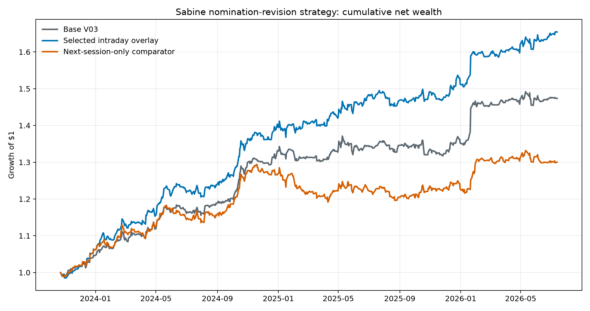
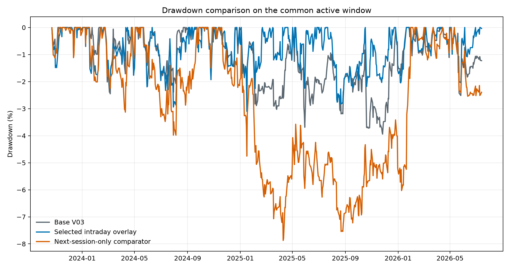
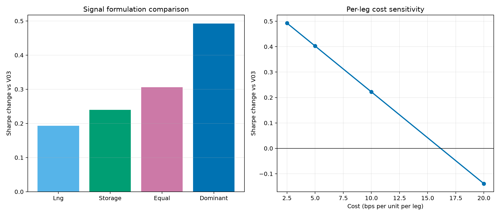

# Sabine nomination-revision intraday overlay

## Research conclusion

The retained specification is a **temporary intraday overlay**, not a new
version of the daily V03 model. It uses information in Sabine-area pipeline
nomination revisions after the Intraday 3 posting and closes the incremental
position at the same NYMEX trading session's settlement, normally on the next
calendar date. The historical result is specific to that post-posting price
window: moving the same signal to the next normal settlement-to-settlement
position produces a materially weaker path.

The final research name is:

> **Sabine dominant nomination-revision intraday overlay**

The word *dominant* refers to the daily selection of the larger absolute
standardized revision. *Intraday overlay* distinguishes this temporary trade
from the persistent V03 position and from the rejected next-session timing
comparator.

## Strategy definition

Two economically distinct scheduled-quantity revisions are evaluated:

1. **LNG demand revision:** TransCameron delivery scheduled quantity from
   Intraday 1 to Intraday 3. A positive revision is bullish Henry Hub because
   it represents a larger scheduled pull toward the LNG route.
2. **Storage tightness revision:** Jefferson Island injection minus withdrawal
   from Timely to Intraday 3. A positive revision is bullish because it
   represents a tighter local balance through greater injection or lower
   withdrawal.

For gas day $`t`$, each raw revision is standardized against strictly earlier
gas days using a causal expanding mean and standard deviation with at least 60
prior observations:

```math
z_{j,t}=\frac{Revision_{j,t}-\overline{Revision}_{j,\lt t}}
{s(Revision_{j,\lt t})}.
```

The signal retains the revision with the larger absolute standardized value:

```math
z_t^*=\mathop{\text{arg max}}\limits_{z\in\{z_t^{LNG},z_t^{Storage}\}}|z|,
```

and the temporary incremental position is

```math
\Delta P_t=0.10\tanh(z_t^*),
```

subject to the total normalized position remaining inside $`[-1,1]`$. The sign
of the selected revision is preserved. This construction allows the LNG and
storage channels to complement one another without mechanically cancelling
on days when they disagree.

## Timing and execution

The execution rule is part of the strategy definition:

```text
Intraday 3 posting
    -> wait 5 minutes
    -> enter at the volume-weighted price of trades during the next 25 minutes
    -> hold only the incremental nomination sleeve
    -> exit at the same held contract's settlement-window VWAP
```

The entry window therefore runs from posting (+5) through posting (+30)
minutes. It uses actual outright NG trade prices and volumes. The contract is
the one already specified by V03: C2 during the five-session early-roll window
and C1 otherwise. Of the 635 selected observations, 631 use the ordinary
14:28--14:30 ET settlement window and four use the corresponding early-close
window. No selected observation relies on a daily-price fallback.

Here *same trading session* does not mean the same civil calendar date.
Sabine's tariff identifies 7:30 p.m. Central as the Intraday 3 quick response
and 10:00 p.m. Central as the time by which scheduled quantities are provided.
The strategy does not assume either fixed time: it reads the native EBB
posting timestamp, whose median is 9:25 p.m. Central in the selected sample.
An ordinary observation therefore typically enters around 9:30--9:55 p.m.
Central on calendar date $`d`$ and exits at 1:28--1:30 p.m. Central
(14:28--14:30 Eastern) on $`d+1`$. Because the NG Globex session runs from 5:00
p.m. to 4:00 p.m. Central, the two legs are in the same session labelled by
the exit date. In this precise exchange-session sense, the retained strategy
can also be described as a **same-session nomination overlay**. [Sabine tariff
nomination schedule](https://www.gasnom.com/ip/SABINE/tariff.cfm?page=40)
[CME NG contract specifications](https://www.cmegroup.com/markets/energy/natural-gas/natural-gas.contractSpecs.html)
[CME NG settlement procedure](https://www.cmegroup.com/content/dam/cmegroup/notices/ser/2019/08/SER-8427.pdf)

The incremental sleeve is charged 2.5 basis points per unit on entry and again
on its full settlement exit. This cost is in addition to the turnover cost
already embedded in V03's daily net return.

The next-session comparator deliberately removes this intraday trade. It shifts
the same incremental signal to the next confirmed trading session, combines it
with the normal V03 position, and applies the ordinary 2.5-basis-point position-
turnover cost. It therefore tests whether the nomination revision is a durable
daily state or short-lived information around the I3 posting.

## Headline comparison

The common active window begins when both 60-day standardized revisions and an
aligned execution window are available.

| Active-window metric | Base V03 | Selected intraday overlay | Next-session-only comparator |
|---|---:|---:|---:|
| Sample | 2023-10-23--2026-07-13 | same | same |
| Trading days | 682 | 682 | 682 |
| Eligible I3 events | -- | 635 | 635 shifted to the next session |
| Net Sharpe | 1.960 | **2.453** | 1.331 |
| Net Sortino | 3.362 | **4.334** | 2.104 |
| CAGR | 15.31% | **20.32%** | 10.13% |
| Total net return | 47.36% | **65.42%** | 30.03% |
| Maximum drawdown | -3.94% | **-3.10%** | -7.87% |
| Simple incremental net-return sum | -- | **+1,162.0 bps** | -1,252.4 bps |

The selected overlay raises active-window Sharpe by 0.493 and makes maximum
drawdown 0.84 percentage point shallower. Its cumulative return exceeds V03 by
18.06 percentage points over the same dates. The next-session implementation
moves in the opposite direction: Sharpe falls by 0.629 and drawdown becomes
materially deeper. The historical evidence therefore supports a short-lived
post-I3 information effect rather than a persistent next-day directional state.



*Figure 1. Net wealth on the common active window. The selected overlay enters
after I3 and exits at settlement; the orange comparator waits for the next
normal position interval.*



*Figure 2. The selected intraday implementation improves the historical
drawdown path, while carrying the same signal into the next session does not.*

## Attribution and robustness

Both selected physical channels contribute positively:

| Selected source | Events | Mean absolute incremental position | Incremental net-return sum | Mean contribution per selected event |
|---|---:|---:|---:|---:|
| TransCameron LNG | 161 | 5.72% | +749.8 bps | +4.66 bps |
| Jefferson Island storage | 474 | 5.88% | +412.2 bps | +0.87 bps |

The two channels play different historical roles. TransCameron is selected
less often but contributes substantially more per selected observation,
making it a lower-frequency, higher-impact signal. Jefferson Island is
selected nearly three times as often and contributes less per observation,
so it behaves more like a higher-frequency, lower-impact source of incremental
information. Their mean absolute position sizes are very similar, which
indicates that this contrast is not primarily caused by a larger allocation to
the LNG channel. The per-event figures remain averages of realized net returns
and therefore reflect both directional accuracy and the size of the subsequent
market move.

The LNG and storage revisions have a historical correlation of approximately
-0.10. Their separate contributions explain why selecting the dominant move
performs better than either single channel or a simple equal combination.

| Signal construction | Sharpe change vs V03 | Incremental net-return sum |
|---|---:|---:|
| LNG only | +0.193 | +682.2 bps |
| Storage only | +0.240 | +422.6 bps |
| Equal combination | +0.306 | +583.3 bps |
| Dominant revision | **+0.493** | **+1,162.0 bps** |

The result is similar when the minimum causal history is changed from 60 gas
days to 20 or 120 days: the Sharpe improvement is +0.416, +0.493, and +0.481,
respectively. It remains positive at assumed costs of 5 and 10 basis points per
leg, but turns negative at 20 basis points per leg. Execution quality is
therefore economically important rather than a cosmetic backtest assumption.



*Figure 3. The dominant two-channel construction has the strongest historical
Sharpe improvement. The benefit declines as the per-leg cost assumption rises.*

The paired circular moving-block bootstrap resamples the base and overlay daily
net returns together using 20-session blocks and 20,000 repetitions. The
observed active-window Sharpe improvement is +0.493; the 95% percentile interval
is approximately [0.042, 0.968]. This describes sampling uncertainty in the
observed return path but does not remove specification-selection effects.

## Interpretation and use

This is the final specification for this **research overlay**, but it is not a
formal V04 model and does not alter V03's stored score or daily position. The
factor is best treated as a separately monitored intraday strategy because:

- its return comes from the interval after the I3 posting and before settlement;
- the next-session-only implementation is negative on the same historical data;
- the input represents scheduled nominations rather than metered physical flow;
- the all-cycle history was assembled retrospectively, although native posting
  timestamps and actual post-posting trades are retained; and
- bid/ask spread and market impact are represented only through the stated
  fixed per-leg cost sensitivity, not through an order-book execution model.

The next research step has two parts. First, if a more complete historical
all-cycle nomination archive becomes available, together with reliable native
posting timestamps and matching intraday NG trades, the same frozen rule can
be tested over a materially longer period without retuning its signal,
position, or execution parameters. Second, prospective shadow capture should
begin immediately for every cycle, posting timestamp, input revision, eligible
contract, entry-window VWAP, and settlement exit. Until the longer historical
test and prospective record are available, this specification should remain
an isolated intraday research overlay rather than be folded into the daily V03
benchmark.

## Reproducibility record

The generation-pinned input contract is
[`manifests/sabine_nomination_overlay_inputs_2026-08-19.json`](../manifests/sabine_nomination_overlay_inputs_2026-08-19.json).
It pins the raw all-cycle Sabine OAC archive, assembled research panel, and
processed execution windows by GCS object generation, SHA-256, byte size,
Parquet dimensions, schema fingerprint, and required columns.

The complete rebuild entry point is
[`naturalgas/pipelines/rebuild_sabine_nomination_overlay.py`](../naturalgas/pipelines/rebuild_sabine_nomination_overlay.py).
It reconstructs the retained LNG and storage revisions and their 20-, 60-,
and 120-gas-day causal z-scores from the raw OAC rows. When the archive
contains more than one complete capture for the same gas day and cycle, it
keeps the capture with the latest native posting timestamp before aggregating
point quantities; the retained snapshot must then have unique point/direction
rows. The pipeline requires exact equality with the assembled panel, runs the
final evaluator, and verifies every output table and daily path against the
shipped artifacts. Run it with:

```bash
python -m naturalgas.pipelines.rebuild_sabine_nomination_overlay --overwrite
```

The final evaluator is
[`naturalgas/evaluate_sabine_nomination_revision_intraday_overlay_final.py`](../naturalgas/evaluate_sabine_nomination_revision_intraday_overlay_final.py).
Its default inputs are materialized automatically from the same pinned GCS
manifest. The overlay can instead be attached to the output of the preceding
V03 reproduction pipeline by passing
`--v03-daily reproduced/models/v03_d1_3_storage_guard/strategy/strategy_daily.parquet`.
The accompanying notebook is
[`notebooks/08_sabine_nomination_revision_intraday_overlay_final.ipynb`](../notebooks/08_sabine_nomination_revision_intraday_overlay_final.ipynb).

The new final artifact directory is
[`results/experiments/sabine_nomination_revision_intraday_overlay_final/`](../results/experiments/sabine_nomination_revision_intraday_overlay_final/).
It contains the complete daily path, headline and robustness tables, figures,
input hashes, strategy definition, and the rejected timing comparator. Earlier
exploratory scripts and `naturalgas/processed/sabine_revision_dominant_signal/`
artifacts remain unchanged.

The raw NYMEX tick files are controlled data and are not redistributed. The
generation-pinned execution-window parquet is the exact processed trade-price
contract used by the result: it retains the native posting timestamp, held
contract, entry and settlement VWAPs, volumes, trade counts, and settlement
method. The handoff therefore provides raw nomination lineage and exact
processed-price reproducibility, but it does not claim a public reconstruction
of those VWAPs from raw ticks.
